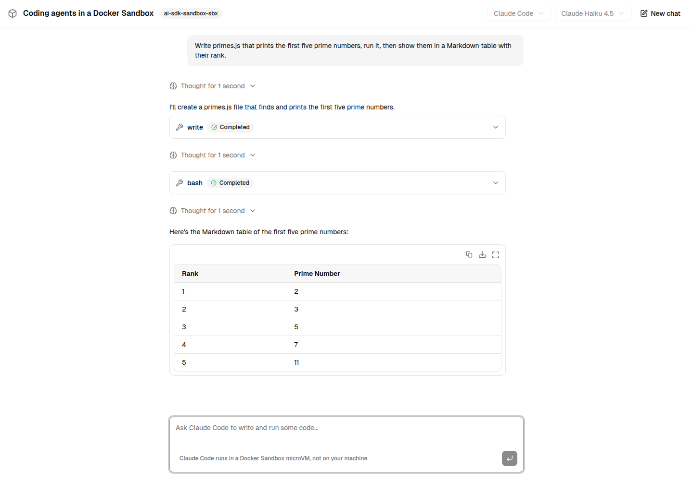
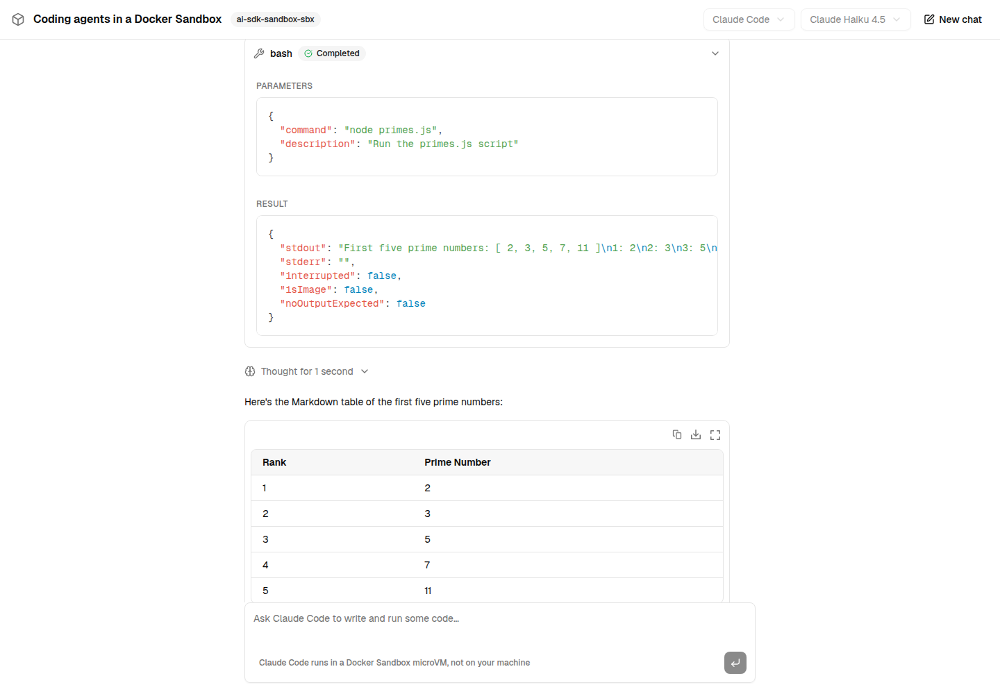
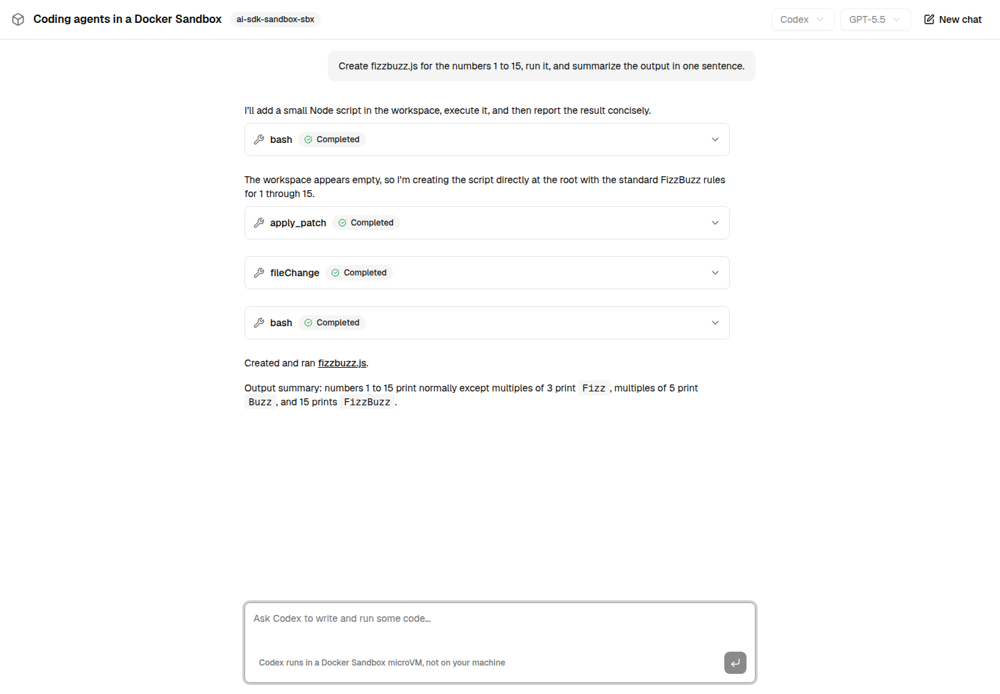

# Next.js chat example

A chat with **Claude Code** or **Codex**, running in a local [Docker Sandbox](https://docs.docker.com/ai/sandboxes/) through [`ai-sdk-sandbox-sbx`](../../packages/sandbox-sbx/README.md): a Next.js page using `useChat`, and one route handler streaming a `HarnessAgent` turn back to it.

The interface is built with [Tailwind CSS](https://tailwindcss.com), [shadcn/ui](https://ui.shadcn.com) and [AI Elements](https://ai-sdk.dev/elements), the shadcn registry of AI components: the conversation, the prompt input, the agent's reasoning, and every tool it ran in the sandbox with its input and output. Answers are rendered as Markdown while they stream in, by [Streamdown](https://streamdown.ai).



Open a tool call to see what the agent ran in the microVM, and what came back:



Pick the coding agent and its model before the first message: Claude Code (Haiku 4.5, Sonnet 5.5, Opus 5.5) or Codex (GPT-5.5, GPT-5.6 Luna, GPT-6 Luna). Both run in the same sandbox.



## Run it

You need Node.js 24 or later, pnpm, and [Docker Sandboxes](https://docs.docker.com/ai/sandboxes/get-started/) (`sbx`) signed in.

```bash
pnpm install
cp examples/next-chat/.env.example examples/next-chat/.env.local   # then set the credentials
pnpm example:dev                                                   # http://localhost:3000
```

Claude Code takes `CLAUDE_CODE_OAUTH_TOKEN` (the long-lived token `claude setup-token` prints for a Claude subscription) or `ANTHROPIC_API_KEY`; Codex takes `OPENAI_API_KEY`. Without them, each harness falls back to the login of its own CLI on your machine (`claude`, `codex`), if it finds one. With a ChatGPT login, Codex asks for a `ChatGPT-Account-ID` header a local sandbox proxy cannot add: it is left out with a warning, and Codex works without it.

The very first message takes a few minutes: the sandbox is created, Claude Code and Codex are installed in it, then it is saved as a template image. Every later start reuses both and answers in seconds.

## How it works

| File                                        | What it does                                                                                                                                                                              |
| ------------------------------------------- | ----------------------------------------------------------------------------------------------------------------------------------------------------------------------------------------- |
| `lib/agent.ts`                              | One `HarnessAgent` per harness and model, the sandbox (resumed when it exists, created from a template with both harnesses otherwise) and the harness session of the current conversation |
| `app/api/chat/route.ts`                     | Sends the last user message to the session and streams the turn back with `toUIMessageStreamResponse()`                                                                                   |
| `lib/harnesses.ts`                          | The coding agents and the models each one offers, shared by the page and the route                                                                                                        |
| `components/chat.tsx`                       | `useChat`, the conversation, the suggestions, the prompt input and the agent and model pickers                                                                                            |
| `components/message-part.tsx`               | One part of a message: Markdown, reasoning, or a tool call                                                                                                                                |
| `components/ai-elements/`, `components/ui/` | Vendored from the AI Elements and shadcn/ui registries with `shadcn add`, and left as upstream ships them                                                                                 |

The coding agent keeps the conversation in its own session, so the route only sends the new message. The bridge listens on a single port, so the example holds one conversation at a time: a new one ends the previous session and keeps the sandbox.

`next.config.ts` keeps the harness packages out of the server bundle (`serverExternalPackages`): the harnesses read their sandbox bridge from files next to their own module.

## Clean up

The sandbox outlives the dev server, so the next start finds it again. To stop it or remove it:

```bash
sbx stop ai-sdk-harness-example   # stops the microVM, keeps its files
sbx rm ai-sdk-harness-example     # removes it
sbx template ls                   # the template images, removable with `sbx template rm`
```
