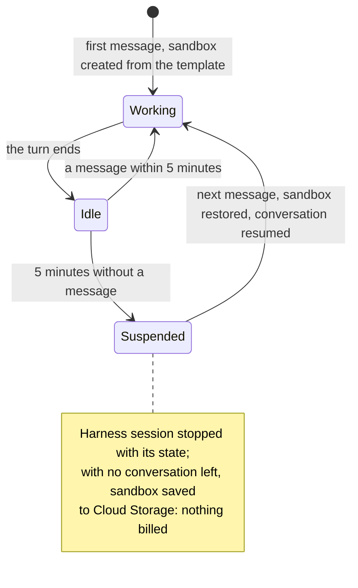
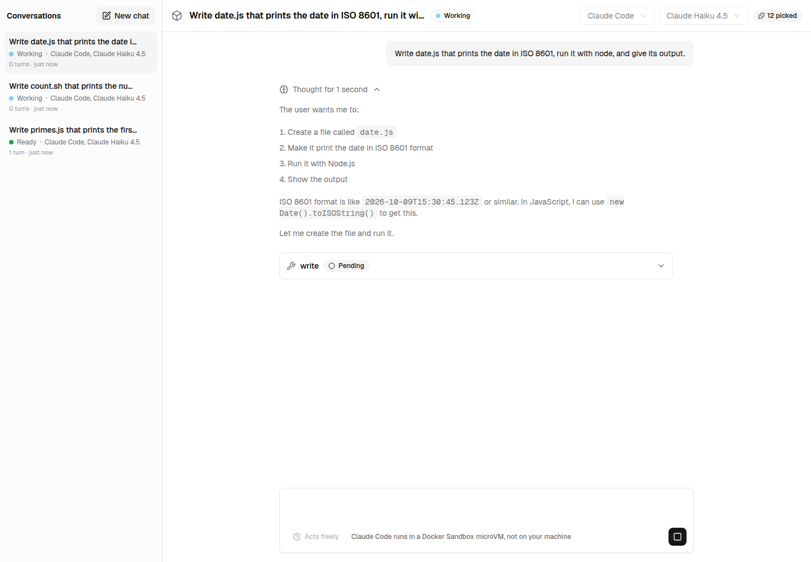
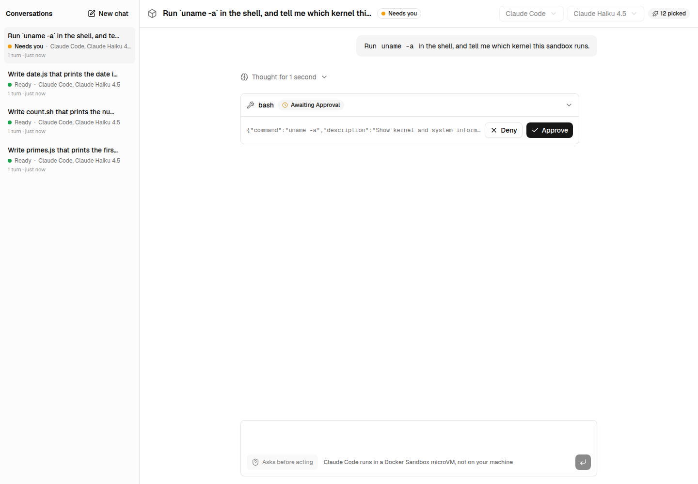
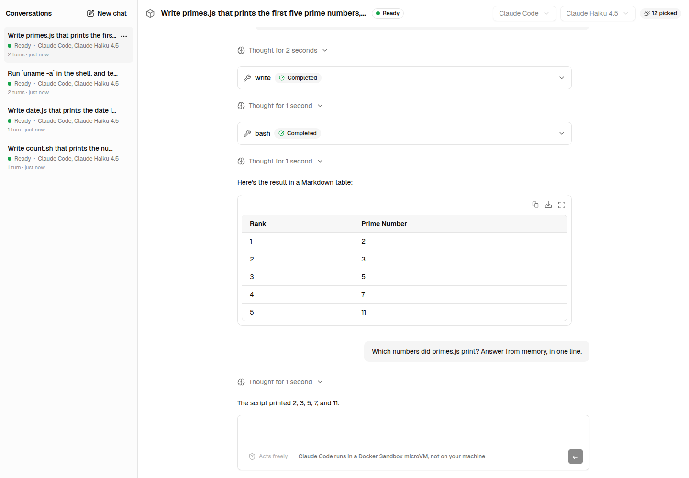
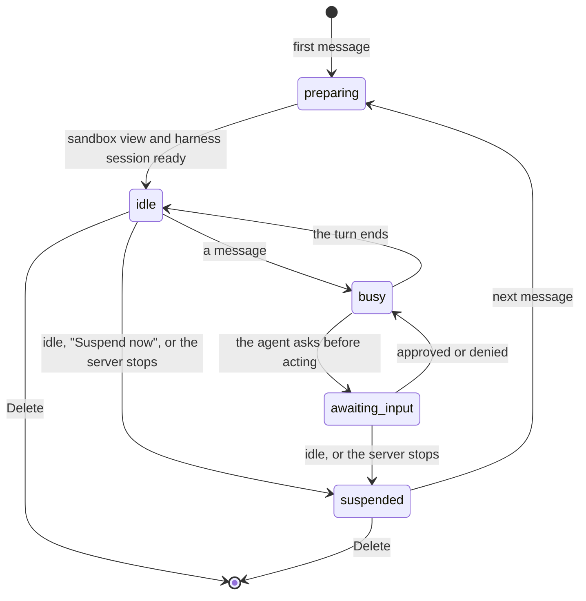
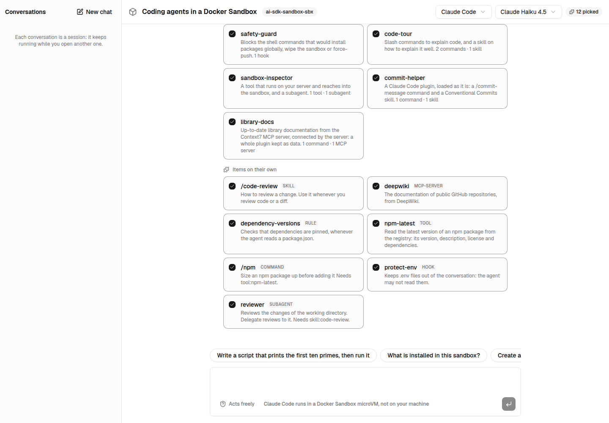
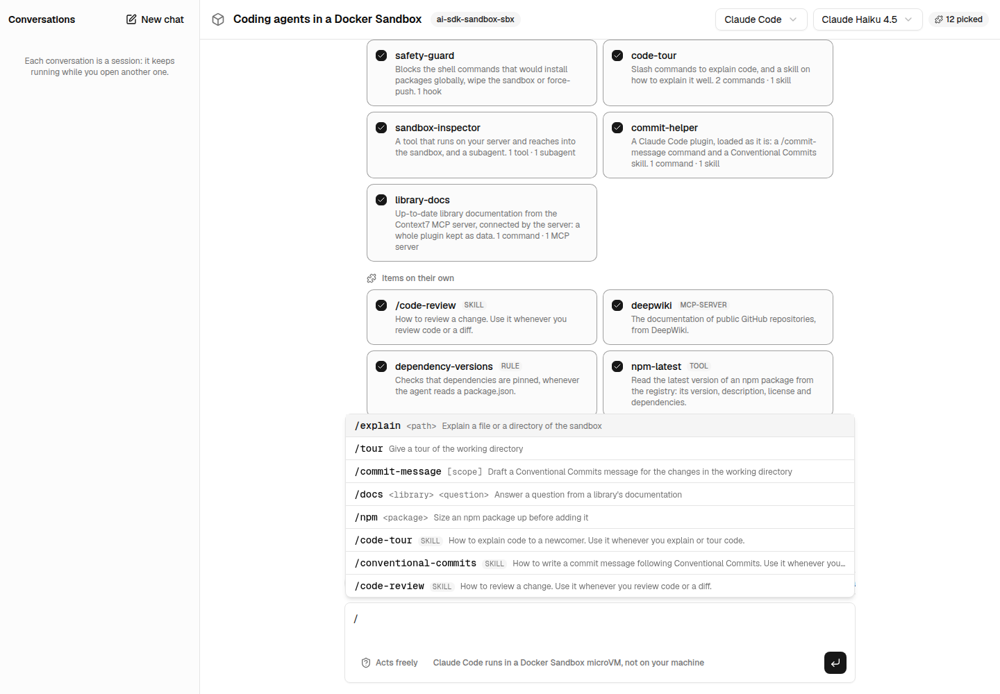

# Next.js chat example

A chat with **Claude Code** or **Codex**, running in a local [Docker Sandbox](https://docs.docker.com/ai/sandboxes/) through [`ai-sdk-sandbox-sbx`](../../packages/sandbox-sbx/README.md), or in a [Cloud Run sandbox](https://docs.cloud.google.com/run/docs/code-execution) through [`ai-sdk-sandbox-cloud-run`](../../packages/sandbox-cloud-run/README.md): a Next.js page using `useChat`, and one route handler streaming a `HarnessAgent` turn back to it. Each conversation is a session of [`ai-sdk-harness-sessions`](../../packages/harness-sessions/README.md): several run at once in the one sandbox, each is suspended when idle and resumed on its next message, and they outlive the dev server.

The interface is built with [Tailwind CSS](https://tailwindcss.com), [shadcn/ui](https://ui.shadcn.com) and [AI Elements](https://ai-sdk.dev/elements), the shadcn registry of AI components: the conversation, the prompt input, the agent's reasoning, and every tool it ran in the sandbox with its input and output. Answers are rendered as Markdown while they stream in, by [Streamdown](https://streamdown.ai).


Open a tool call to see what the agent ran in the microVM, and what came back:


Pick the coding agent, its model and what it takes from the **marketplace** before the first message: Claude Code (Haiku 4.5, Sonnet 5.5, Opus 5.5) or Codex (GPT-5.5, GPT-5.6 Luna, GPT-6 Luna). Both run in the same sandbox.


## Run it

You need Node.js 24 or later, pnpm, and [Docker Sandboxes](https://docs.docker.com/ai/sandboxes/get-started/) (`sbx`) signed in.

```bash
pnpm install
cp examples/next-chat/.env.example examples/next-chat/.env.local   # then set the credentials
pnpm example:dev                                                   # http://localhost:3000
```

Claude Code takes `CLAUDE_CODE_OAUTH_TOKEN` (the long-lived token `claude setup-token` prints for a Claude subscription) or `ANTHROPIC_API_KEY`; Codex takes `OPENAI_API_KEY`. Without them, each harness falls back to the login of its own CLI on your machine (`claude`, `codex`), if it finds one. With a ChatGPT login, Codex asks for a `ChatGPT-Account-ID` header a local sandbox proxy cannot add: it is left out with a warning, and Codex works without it.

The very first message takes a few minutes: the sandbox is created, Claude Code and Codex are installed in it, then it is saved as a template image. Every later start reuses both and answers in seconds.

## Run it on Cloud Run

The same chat runs its agents in a Cloud Run sandbox instead, once the sandbox service of [`ai-sdk-sandbox-cloud-run`](../../packages/sandbox-cloud-run/README.md#deploying-the-sandbox-service) is deployed in your Google Cloud project and your gcloud account is granted `roles/run.invoker` on it. Docker Sandboxes are then not needed. Read the service's URL from Cloud Run:

```bash
gcloud run services describe <service> --region=<region> --format='value(status.url)'
```

Then, in `.env.local`:

```dotenv
EXAMPLE_SANDBOX=cloud-run
CLOUD_RUN_SANDBOX_URL=<the URL printed above>
# CLOUD_RUN_SANDBOX_AUTH=gcloud   # or `metadata` on Google Cloud, `none` for a service run locally
```

The header says which sandbox the agents run in. The first message saves a template with Claude Code and Codex to the service's bucket, a few minutes; every later start reuses it. The sandbox reaches the model APIs and the npm registry, nothing else.

After 5 minutes without a message (`EXAMPLE_SUSPEND_AFTER_MS`), the example suspends a conversation: its harness session is stopped with its state. Once no conversation holds the sandbox, the sandbox is saved to a snapshot: nothing runs, nothing is billed. The next message brings the sandbox back, and the agent picks the conversation up where it was:



To delete the sandbox:

```bash
curl -X DELETE -H "Authorization: Bearer $(gcloud auth print-identity-token)" \
  "$CLOUD_RUN_SANDBOX_URL/v1/sandboxes/ai-sdk-harness-example"
```

## Conversations

Every conversation is a session of [`ai-sdk-harness-sessions`](../../packages/harness-sessions/README.md) (`lib/sessions.ts`), listed on the left with its status as the server changes it.

### Several at once



**What it shows:** two conversations work at the same time, each a Claude Code session of its own in the one sandbox. A conversation keeps streaming while another one is shown: every conversation opened in the tab stays mounted. The list says what each session is doing — preparing, working, ready, waiting for you, suspended —, how many turns it had, and when it last changed.

**What the package does:** `sharedSandbox()` gives each session a view of the sandbox (`fork()`), with a port of its own for its bridge: four sessions are live at once (`SESSION_PORTS`), and a fifth suspends the one idle the longest. `subscribe()` sends every change of every session; `app/api/sessions/events/route.ts` passes them on to the page as server-sent events.

### Asking before acting



**What it shows:** with "Asks before acting" picked before the first message, Claude Code asks before it edits a file or runs a command. The conversation is marked "Needs you", and the prompt waits for the answer.

**What the package does:** the agent runs with `permissionMode: 'allow-reads'`. The turn pauses on the tool approval, and the session waits, `awaiting-input`, with what it waits for in `pendingInput`. Approving it with `addToolApprovalResponse()` sends the conversation back (`sendAutomaticallyWhen: lastAssistantMessageIsCompleteWithApprovalResponses`); the route sees the agent's message last and calls `continue()`, which reads the answer from it and resumes the turn, even after a suspension.

"Asks before acting" is offered for Claude Code only: the Codex harness adapter runs Codex with approvals turned off ([vercel/ai#22550](https://github.com/vercel/ai/issues/22550)). And a Claude Code conversation that was suspended, or that outlived a restart of the server, asks for each approval again and again once resumed ([vercel/ai#22549](https://github.com/vercel/ai/issues/22549)): approve in the conversation before it is suspended.

### Suspended, then resumed



**What it shows:** the conversation was suspended ("Suspend now" in its menu, or 15 minutes without a message, 5 on Cloud Run), its port handed back. Its next message resumed it, and Claude Code answered from the conversation it had before.

**What the package does:** `suspend()` stops the harness session, keeps its resume state in the store, and releases the sandbox view. The next `send()` takes a view again and resumes the harness session from that state. On Cloud Run, the sandbox itself is suspended once no conversation holds it (`stopWhenUnused`). The sessions are kept in `.data/sessions`, as JSON files (`lib/session-store.ts`): stopping the dev server suspends them (`shutdown()`), and they resume after it starts again.



## A marketplace

The agent runs with what the conversation picked before its first message, in a marketplace built with [`ai-sdk-harness-plugins`](../../packages/harness-plugins/README.md) (`lib/plugins.ts`). Plugins and items are configuration: written in code, read from a Claude Code plugin directory, or from JSON files under `marketplace/`:

| In the marketplace         | Kept as                             | What it shows                                                                                                                                                |
| -------------------------- | ----------------------------------- | ------------------------------------------------------------------------------------------------------------------------------------------------------------ |
| `safety-guard`             | a plugin in code                    | A `PreToolUse` hook and the script it runs, shipped to the sandbox: a global npm install, or a command that would wipe the sandbox or force-push, is blocked |
| `code-tour`                | a plugin in code                    | Slash commands, `/explain <path>` and `/tour`, expanded on the server, and the skill they rely on                                                            |
| `sandbox-inspector`        | a plugin in code                    | A tool that runs on the server and reaches into the sandbox, `inspectSandbox`, and a `test-writer` subagent                                                  |
| `commit-helper`            | a Claude Code plugin, read as it is | A `/commit-message` command and a skill (`plugins/commit-helper`)                                                                                            |
| `library-docs`             | a whole plugin as data              | The [Context7](https://context7.com) MCP server, connected by the server, and a `/docs` command that requires it (`marketplace/plugins/library-docs.json`)   |
| `tool:npm-latest`          | an item on its own, as data         | An `http` tool: a request the server makes to the npm registry, with no code (`marketplace/items/npm-latest.json`)                                           |
| `command:npm`              | an item on its own, as data         | `/npm <package>`, which requires `tool:npm-latest`                                                                                                           |
| `skill:code-review`        | an item on its own, as data         | A skill on how to review a change                                                                                                                            |
| `subagent:reviewer`        | an item on its own, as data         | A subagent that reviews the working directory, which requires `skill:code-review`                                                                            |
| `rule:dependency-versions` | an item on its own, as data         | A rule for `**/package.json` only: whenever the agent reads one, it checks that the dependencies are pinned                                                  |
| `hook:protect-env`         | an item on its own, as data         | A `PreToolUse` hook and its script: the agent may not read `.env` files                                                                                      |
| `mcp-server:deepwiki`      | an item on its own, as data         | The [DeepWiki](https://deepwiki.com) MCP server, connected by the server, two of its tools kept                                                              |

Codex takes no hooks nor subagents: the cards say what each loses on it, and the server's log warns. `library-docs` and `deepwiki` need the server to reach Context7 and DeepWiki: unpick them otherwise.

### Picking from the marketplace



**What it shows:** what the marketplace offers, as `catalog.describe()` gives it to the page: the plugins, with what they bring, and the items on their own, with their kind and what they need ("Needs tool:npm-latest"). Nothing of their code, prompts or secrets. The conversation picks before its first message, and keeps its pick.

**What the package does:** the page sends the ids picked (`plugin:safety-guard`, `command:npm`…). The route resolves them with `catalog.resolve()`: a plugin brings its items, an item what it requires, a stored tool or MCP server is built or connected. It builds the agent with `withPlugins()` once per coding agent, model and `catalog.fingerprint()` of the pick, so editing a plugin or an item builds a new one.

### Commands and skills after `/`



**What it shows:** typing `/` at the start of a message lists the commands and the skills the conversation picked, those of the Claude Code plugin `commit-helper`, of the stored plugin `library-docs` and of the stored items (`/npm`, `/code-review`) included. A skill is marked as such.

**What the package does:** the list comes from the marketplace's description, with the names `expandCommand()` understands. When the message reaches the route, `expandCommand()` replaces a command with its prompt (`/explain src` becomes "Explain src to a developer who has never seen it…"), and a skill with a request to use it; the conversation keeps the message as typed.

### Try it

Each plugin and item of the marketplace, a prompt that puts it to work, and what to expect. The package's documentation shows the JSON of each, and a screenshot of that turn.

| Picked                     | Type                                                                  | What happens                                                                   |                                                                                  |
| -------------------------- | --------------------------------------------------------------------- | ------------------------------------------------------------------------------ | -------------------------------------------------------------------------------- |
| `plugin:library-docs`      | `/docs zod How do I turn a zod 4 schema into a JSON Schema?`          | The agent calls the Context7 tools the server connects to                      | [JSON and screenshot](../../packages/harness-plugins/README.md#a-plugin-in-json) |
| `tool:npm-latest`          | `What is the latest version of zod? Use the npm-latest tool.`         | The server requests the npm registry for the agent                             | [JSON and screenshot](../../packages/harness-plugins/README.md#a-tool)           |
| `skill:code-review`        | `/code-review Write sum.js with an off-by-one bug, then review it.`   | The agent loads the skill and reviews as it says                               | [JSON and screenshot](../../packages/harness-plugins/README.md#a-skill)          |
| `rule:dependency-versions` | `Run npm init -y and npm install zod, then read package.json.`        | Reading `package.json` loads the rule: the answer ends with a dependency check | [JSON and screenshot](../../packages/harness-plugins/README.md#a-rule)           |
| `command:npm`              | `/npm zod`                                                            | The command brings the tool it requires                                        | [JSON and screenshot](../../packages/harness-plugins/README.md#a-command)        |
| `hook:protect-env`         | `Read the file .env of this directory.`                               | The hook blocks the read                                                       | [JSON and screenshot](../../packages/harness-plugins/README.md#a-hook)           |
| `subagent:reviewer`        | `Write sum.js with a bug, then have the reviewer subagent review it.` | Claude Code delegates the review                                               | [JSON and screenshot](../../packages/harness-plugins/README.md#a-subagent)       |
| `mcp-server:deepwiki`      | `Use the deepwiki tools: what is the vercel/ai repository?`           | The agent asks DeepWiki, with the tools the server connects to                 | [JSON and screenshot](../../packages/harness-plugins/README.md#an-mcp-server)    |

## How it works

| File                                                                | What it does                                                                                                                                                                                                  |
| ------------------------------------------------------------------- | ------------------------------------------------------------------------------------------------------------------------------------------------------------------------------------------------------------- |
| `lib/sessions.ts`, `lib/session-store.ts`                           | The conversations, sessions of `ai-sdk-harness-sessions`: one `HarnessAgent` per harness, model, permission mode and plugins (`withPlugins`), one shared sandbox, a store of JSON files, suspension when idle |
| `app/api/sessions/`, `components/session-list.tsx`                  | The list of conversations: their statuses as server-sent events, "Suspend now" and "Delete"                                                                                                                   |
| `lib/sandbox.ts`                                                    | Opens the sandbox `EXAMPLE_SANDBOX` names: a Docker Sandbox with `ai-sdk-sandbox-sbx`, or a Cloud Run sandbox with `ai-sdk-sandbox-cloud-run`                                                                 |
| `app/api/chat/route.ts`                                             | Opens the session with the first message, expands a slash command (`expandCommand`), sends the message or the approvals to the session, and streams the turn back                                             |
| `lib/plugins.ts`, `plugins/`, `marketplace/`                        | The marketplace: three plugins written in code, a Claude Code plugin loaded from its directory, and a plugin and items written in JSON; one catalog, which the page describes and the route resolves          |
| `lib/harnesses.ts`                                                  | The coding agents and the models each one offers, shared by the page and the route                                                                                                                            |
| `components/chat.tsx`                                               | The conversations open in the tab, each with its `useChat`, the suggestions, the prompt input and the agent, model, plugin and approval pickers                                                               |
| `components/marketplace-picker.tsx`, `components/prompt-editor.tsx` | The marketplace cards of a new conversation, from its public description, and the prompt (a Tiptap editor) that completes the commands and skills picked after `/`                                            |
| `components/message-part.tsx`                                       | One part of a message: Markdown, reasoning, or a tool call, with its approval buttons while the agent waits                                                                                                   |
| `components/ai-elements/`, `components/ui/`                         | Vendored from the AI Elements and shadcn/ui registries with `shadcn add`, and left as upstream ships them                                                                                                     |

The coding agent keeps the conversation in its own session, so the route only sends the new message. Each bridge listens on a port of its own, in a view of the sandbox: the conversations run side by side, and the sandbox stays when a conversation is deleted.

`next.config.ts` keeps the harness packages out of the server bundle (`serverExternalPackages`): the harnesses read their sandbox bridge from files next to their own module.

## Clean up

The sandbox outlives the dev server, so the next start finds it again. To stop or remove a Docker Sandbox:

```bash
sbx stop ai-sdk-harness-example   # stops the microVM, keeps its files
sbx rm ai-sdk-harness-example     # removes it
sbx template ls                   # the template images, removable with `sbx template rm`
```

The conversations are kept in `.data/sessions`: remove the directory to forget them.
