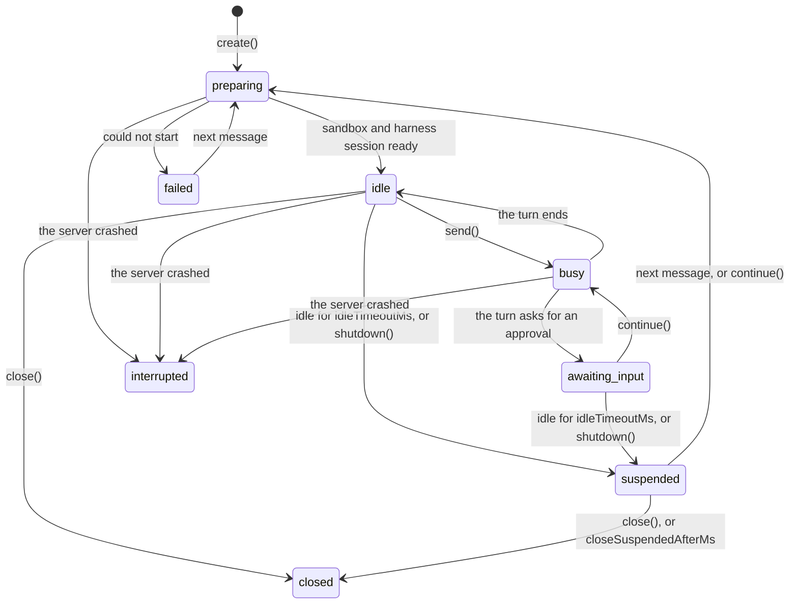

# ai-sdk-harness-sessions

<p align="center">
  <a href="https://www.npmjs.com/package/ai-sdk-harness-sessions"></a>
  <a href="https://github.com/fpasquet/ai-sdk-harness/actions/workflows/ci.yml"></a>
  
  
  <a href="https://github.com/fpasquet/ai-sdk-harness/blob/main/LICENSE"></a>
</p>

Sessions for [AI SDK harness agents](https://ai-sdk.dev/docs/ai-sdk-harnesses/harness-agent): the whole lifecycle of your users' conversations with Claude Code, Codex and the other runtimes `HarnessAgent` drives. One turn at a time, **suspended when idle and resumed on the next message**, kept across restarts of your server, waiting for an approval as long as it takes, and **several of them side by side in one sandbox**.


## At a glance

`HarnessAgent` gives you a session and leaves the rest to you: which session a message goes to, what happens to a session nobody writes to, to a turn under way when your server stops, to the conversation the user wants to read again. A session manager does it:

```ts
import { createSessionManager, sharedSandbox } from 'ai-sdk-harness-sessions';

const sessions = createSessionManager({
  // The agent of a session, from what you keep with it.
  agent: ({ metadata }) => agents[metadata.agent],
  // One sandbox for every session, each with a port of its own for its bridge.
  sandboxes: sharedSandbox({
    open: openSandbox,
    ports: Array.from({ length: 4 }, (_, i) => 4001 + i),
  }),
  // A session nobody writes to for 10 minutes is suspended; the next message resumes it.
  idleTimeoutMs: 10 * 60_000,
});

// A route handler: the turn streams back to useChat.
await sessions.create({ id, metadata: { agent: 'reviewer' } });
const turn = await sessions.send(id, { message, abortSignal: request.signal });
return turn.toUIMessageStreamResponse();
```

| What happens                           | What the manager does                                                                                                |
| -------------------------------------- | -------------------------------------------------------------------------------------------------------------------- |
| A first message                        | Opens a sandbox, or a view of a shared one, and a harness session, in the background: a message sent meanwhile waits |
| A message while a turn runs            | Refuses it: one turn at a time per session (`SessionConflictError`, status `busy`)                                   |
| The turn asks approval for a tool call | Keeps the session `awaiting-input` until `continue()` brings the answer, even after a suspension or a restart        |
| Nobody writes for `idleTimeoutMs`      | Suspends the session: its harness session stops with its state, its sandbox is freed. The next message resumes it    |
| Every sandbox slot is taken            | Suspends the session idle the longest to make room                                                                   |
| Your server stops (`shutdown()`)       | Cuts the turns under way short, and suspends every session: the next start resumes them on their next message        |
| Your server crashes                    | Marks the sessions it held `interrupted` at the next start: their conversation can still be read                     |
| You want the conversation again        | `get(id)` gives it as `useChat` shows it, `list()` every session, `subscribe()` every change, for a list to follow   |

## Installation

```bash
pnpm add ai-sdk-harness-sessions
```

It works with the agents and sandboxes you already have: `@ai-sdk/harness` and `ai` are peer dependencies, and a sandbox package such as [`ai-sdk-sandbox-sbx`](https://ai-sdk-harness.pages.dev/docs/packages/sandbox-sbx) or [`ai-sdk-sandbox-cloud-run`](https://ai-sdk-harness.pages.dev/docs/packages/sandbox-cloud-run) gives the sandbox.

## Usage

### The manager

Create one manager for your server, and keep it: with Next.js, on `globalThis`, so that a reload of the module in development does not start a second one.

```ts title="lib/sessions.ts"
import { createClaudeCode } from '@ai-sdk/harness-claude-code';
import { createHarnessSandboxTemplate, HarnessAgent } from '@ai-sdk/harness/agent';
import {
  createSbxNetworkSandboxSession,
  resumeSbxNetworkSandboxSession,
  SbxSandboxNotFoundError,
} from 'ai-sdk-sandbox-sbx';
import { createSessionManager, sharedSandbox } from 'ai-sdk-harness-sessions';

const harness = createClaudeCode();
const agent = new HarnessAgent({ harness, model: 'claude-sonnet-5-5' });

/** The sandbox the sessions share: found again when it exists, created from a template otherwise. */
async function openSandbox() {
  const settings = { sandboxId: 'my-app', ports: [4000] };
  try {
    const sandbox = await resumeSbxNetworkSandboxSession(settings);
    // The bridges a previous run of the server left behind still hold their ports.
    await sandbox.killAllProcesses();
    return sandbox;
  } catch (error) {
    if (!(error instanceof SbxSandboxNotFoundError)) throw error;
  }
  const template = await createHarnessSandboxTemplate({ harnesses: [harness] });
  return createSbxNetworkSandboxSession({ ...settings, template });
}

export const sessions = createSessionManager<{ title: string }>({
  agent: () => agent,
  sandboxes: sharedSandbox({
    open: openSandbox,
    ports: Array.from({ length: 4 }, (_, i) => 4001 + i),
  }),
  idleTimeoutMs: 10 * 60_000,
});

// Suspended rather than lost when the server is told to stop.
process.once('SIGTERM', () => void sessions.shutdown().finally(() => process.exit(0)));
```

`agent` is called when a session starts and each time it resumes, with the session's `metadata`: what you keep with it, the agent it runs, a title, its owner. Build each agent once and return it again. The metadata is kept as JSON.

### A route

The first message creates the session; every message is sent to it. The session keeps the conversation, so only the new message goes to the agent: `prompt` sends something else, a slash command expanded for instance, while the conversation keeps the message as it was written.

```ts title="app/api/chat/route.ts"
import type { UIMessage } from 'ai';

import { SessionConflictError } from 'ai-sdk-harness-sessions';

import { sessions } from '@/lib/sessions';

export async function POST(request: Request) {
  const { id, messages } = (await request.json()) as { id: string; messages: UIMessage[] };
  const message = messages.at(-1)!;
  if ((await sessions.get(id)) === undefined) {
    await sessions.create({ id, metadata: { title: 'New conversation' } });
  }
  try {
    const turn = await sessions.send(id, { message, abortSignal: request.signal });
    return turn.toUIMessageStreamResponse();
  } catch (error) {
    if (SessionConflictError.isInstance(error)) return new Response(error.message, { status: 409 });
    throw error;
  }
}
```

The turn is read to its end on your server as well: a user who closes the tab does not leave the session hanging, and the session is written either way. `abortSignal: request.signal` lets the stop button of `useChat` cut the turn short; leave it out for turns that go on without the client. `interrupt(id)` cuts a turn short from anywhere.

### Showing the conversations again

```ts
const conversations = await sessions.list(); // every session, without its messages
const conversation = await sessions.get(id); // with its messages, for useChat({ messages })
```

`subscribe()` calls you with every change: a status, the end of a turn, a deletion. Send them to the page as server-sent events, and a list of conversations follows each one live:

```ts title="app/api/sessions/events/route.ts"
export function GET(request: Request) {
  const encoder = new TextEncoder();
  const stream = new ReadableStream({
    start(controller) {
      const unsubscribe = sessions.subscribe((event) =>
        controller.enqueue(encoder.encode(`data: ${JSON.stringify(event)}\n\n`)),
      );
      request.signal.addEventListener('abort', () => {
        unsubscribe();
        controller.close();
      });
    },
  });
  return new Response(stream, { headers: { 'content-type': 'text/event-stream' } });
}
```

## The lifecycle



| Status           | What it means                                                                                                      |
| ---------------- | ------------------------------------------------------------------------------------------------------------------ |
| `preparing`      | Its sandbox and harness session are being opened, or brought back from `suspended`. A message sent meanwhile waits |
| `idle`           | Ready for a message                                                                                                |
| `busy`           | A turn is under way. Another message is refused until it ends                                                      |
| `awaiting-input` | The turn paused on a tool call that waits for you: an approval, or the result of a tool your application runs      |
| `suspended`      | Stopped, its state kept in the store and its sandbox freed. The next message, or `continue()`, brings it back      |
| `closed`         | Ended for good. Its conversation can still be read                                                                 |
| `failed`         | A new session that could not start: a sandbox that did not open, say. The next message tries again                 |
| `interrupted`    | Cannot be brought back: the server stopped without suspending it. Its conversation can still be read               |

A session that fails to resume stays `suspended`, with the reason in its `error`: the next message tries again from the same state.

### Suspended, then resumed

A suspended session costs nothing but its record: its harness session is stopped, and what it needs to pick the conversation up is kept in the store. On the next message, the manager reattaches to its sandbox, its files where it left them, and resumes its harness session, which carries on the conversation where it was:


**What it shows:** the conversation was suspended from the list ("Suspend now", `suspend(id)`), its port handed back. The next message resumed it, and Claude Code answered from the conversation it had before.

**What the package does:** `suspend()` stops the harness session with `HarnessAgentSession.stop()`, writes the session `suspended` with its resume state, and suspends its sandbox lease. The next `send()` acquires the lease again (`resume: true`) and creates the harness session with `resumeFrom`.

### Waiting for an approval

With `permissionMode: 'allow-reads'`, Claude Code asks before it edits a file or runs a command, and with `toolApproval` any runtime asks before it calls one of your tools. Codex does not ask before using its own tools yet: its harness adapter only takes `permissionMode: 'allow-all'` ([vercel/ai#22550](https://github.com/vercel/ai/issues/22550)). The turn pauses, and the session waits, `awaiting-input`, with what it waits for in `pendingInput`:


`continue()` answers it. It takes the answers as `HarnessAgent.continueStream()` does, or reads them from the last message `useChat` sends back once `addToolApprovalResponse()` filled them in:

```ts
// useChat({ sendAutomaticallyWhen: lastAssistantMessageIsCompleteWithApprovalResponses })
// sends the conversation back once every approval is answered: its last message is the agent's.
const last = messages.at(-1)!;
const turn =
  last.role === 'assistant'
    ? await sessions.continue(id, { message: last })
    : await sessions.send(id, { message: last });
```

A session suspended while it waited keeps what it waits for: `continue()` resumes the session, without its paused turn, whose harness bridge the suspension stopped, and tells the agent the answers in a message. With Claude Code, see [Limitations](#limitations).

## Sandboxes

Where each session runs is up to `sandboxes`:

| Strategy                                             | What each session gets                                                                                      | When                                                                  |
| ---------------------------------------------------- | ----------------------------------------------------------------------------------------------------------- | --------------------------------------------------------------------- |
| `sharedSandbox({ open, ports, stopWhenUnused })`     | A view of one sandbox (`fork()`), with a port of its own for its bridge, and a working directory of its own | One user, or sessions that may see each other's files                 |
| `sandboxPerSession({ create, resume, maxSessions })` | A sandbox of its own, stopped when the session is suspended, destroyed when it is closed                    | Sessions that must not see each other: one per user or per repository |
| Your own `SessionSandboxes`                          | What `acquire(sessionId, { resume })` returns                                                               | A pool, a sandbox per user shared by their sessions…                  |

`sharedSandbox()` takes sandboxes that give views of themselves, `fork({ ports })`: those of `ai-sdk-sandbox-sbx` and `ai-sdk-sandbox-cloud-run`. A suspended session hands its port back and keeps its files in the sandbox. With `stopWhenUnused`, the sandbox itself is stopped once no session holds it, and opened again with the next one: on Cloud Run, a stopped sandbox costs its snapshot's storage alone.

```ts
import { createSbxNetworkSandboxSession, resumeSbxNetworkSandboxSession } from 'ai-sdk-sandbox-sbx';
import { sandboxPerSession } from 'ai-sdk-harness-sessions';

const sandboxes = sandboxPerSession({
  create: (sessionId) =>
    createSbxNetworkSandboxSession({ sandboxId: `chat-${sessionId}`, ports: [4000], template }),
  resume: (sessionId) =>
    resumeSbxNetworkSandboxSession({ sandboxId: `chat-${sessionId}`, ports: [4000] }),
  maxSessions: 8,
});
```

### How many sessions run at once

Claude Code and Codex run behind a bridge: a process the harness starts in the sandbox for each session, listening on a port of the sandbox that your server reaches over a WebSocket (published on `127.0.0.1` by `sbx`, tunnelled by the Cloud Run service). The harness takes the first port of the sandbox session it is given, so two sessions handed the same sandbox would both listen on it. `sharedSandbox()` gives each session a view of the sandbox with a port of its own: the same microVM, the same installed tools, a working directory of its own, and a port of `ports` for its bridge.

```ts
sharedSandbox({ open: openSandbox, ports: Array.from({ length: 4 }, (_, i) => 4001 + i) }); // 4001 … 4004
```

The numbers are any free ports inside the sandbox; their count is what matters. It bounds the sessions that are **live** at once — `preparing`, `idle`, `busy` or `awaiting-input`, each with a bridge and a runtime running —, not the conversations you keep: a `suspended` session holds no port. With four ports, ten conversations can be open, four live and six suspended until their next message.

When a fifth session starts, or a suspended one resumes:

| The four live sessions                                      | What happens                                                                                                                  |
| ----------------------------------------------------------- | ----------------------------------------------------------------------------------------------------------------------------- |
| One of them, at least, is `idle`                            | The one idle the longest is suspended, and the new session takes its port                                                     |
| None is `idle`: all `busy`, `preparing` or `awaiting-input` | Refused with `SessionCapacityError`: an HTTP API answers 503. A session waiting for an approval is not suspended to make room |
| `suspendIdleWhenFull: false`                                | Refused with `SessionCapacityError` as soon as the four ports are taken                                                       |

To run ten turns at the same time, give ten ports — `Array.from({ length: 10 }, (_, i) => 4001 + i)` — and the sandbox the CPUs and memory ten runtimes need (`cpus` and `memory` of `createSbxNetworkSandboxSession()`), or give each session a sandbox of its own with `sandboxPerSession()`, or spread the sessions over several shared sandboxes with a `SessionSandboxes` of your own. A short `idleTimeoutMs` frees the ports of the sessions nobody writes to: four ports then serve many more open conversations.

## Keeping sessions

The manager writes every change to a `SessionStore`: the session with its conversation, and, while it is suspended, the state it resumes from. `createMemorySessionStore()`, the default, keeps them in memory, lost with the process. To keep them across restarts, implement the five methods on your database:

```ts
import type { SessionStore } from 'ai-sdk-harness-sessions';

const store: SessionStore<Metadata> = {
  save: async (record, resumeState) => {
    await db.sessions.upsert(record);
    // Kept while the session is suspended, dropped otherwise.
    await (resumeState
      ? db.resumeStates.upsert(record.id, resumeState)
      : db.resumeStates.delete(record.id));
  },
  get: (id) => db.sessions.find(id),
  list: () => db.sessions.findAll({ without: ['messages'] }),
  getResumeState: (id) => db.resumeStates.find(id),
  delete: async (id) => {
    await db.sessions.delete(id);
    await db.resumeStates.delete(id);
  },
};
```

A resume state holds secrets: the token of the harness bridge, the placeholders of the credentials. Keep it apart from what you show, as you would a session token. The [Next.js example](https://github.com/fpasquet/ai-sdk-harness/tree/main/examples/next-chat) keeps its sessions in JSON files (`lib/session-store.ts`).

Keep one manager per store: at its start, a manager takes the sessions the store holds as live for those of a process that crashed, and marks them `interrupted`.

## Reference

### `createSessionManager(options)`

| Option                  | Default                  | Description                                                                                         |
| ----------------------- | ------------------------ | --------------------------------------------------------------------------------------------------- |
| `agent`                 | required                 | The agent of a session, from `{ id, metadata }`: called at each start and resume                    |
| `sandboxes`             | required                 | `sharedSandbox()`, `sandboxPerSession()` or your own `SessionSandboxes`                             |
| `store`                 | in memory                | Where sessions are kept: a `SessionStore`                                                           |
| `idleTimeoutMs`         | never                    | Suspend a session idle, or awaiting input, for this long                                            |
| `closeSuspendedAfterMs` | never                    | Close a session suspended for this long                                                             |
| `turnTimeoutMs`         | never                    | Cut a turn short after this long                                                                    |
| `suspendIdleWhenFull`   | `true`                   | When every sandbox slot is taken, suspend the session idle the longest rather than refuse a new one |
| `generateId`            | `crypto.randomUUID`      | The ids of new sessions and of the messages of their turns                                          |
| `errorMessage`          | `getHarnessErrorMessage` | What a client is told of an error in a turn; the session's `error` keeps the full message           |
| `onError`               | `console.error`          | Called with what fails in the background: a start, a suspension, a write to the store               |

| Method                     | What it does                                                                                               |
| -------------------------- | ---------------------------------------------------------------------------------------------------------- |
| `create({ id, metadata })` | Opens a session, and returns it `preparing`                                                                |
| `send(id, options)`        | Starts a turn in reply to a message (`message`, `prompt`, `abortSignal`): a `SessionTurn`                  |
| `continue(id, options)`    | Resumes a paused turn with its answers (`message`, `toolApprovalContinuations`, `toolResultContinuations`) |
| `interrupt(id)`            | Cuts the turn under way short                                                                              |
| `suspend(id)`              | Suspends an idle session now                                                                               |
| `close(id)`                | Ends a session for good                                                                                    |
| `delete(id)`               | Closes a session, then forgets it                                                                          |
| `get(id)`, `list()`        | A session with its conversation; every session without                                                     |
| `subscribe(listener)`      | Every change, `{ type: 'updated', session }` or `{ type: 'deleted', sessionId }`                           |
| `shutdown()`               | Suspends every live session and shuts the sandboxes down                                                   |

A `SessionTurn` has the turn as a UI message `stream`, `toUIMessageStreamResponse()` for a route, and `done`, the session once the turn is over and written.

### Errors

Each has an `isInstance()` that recognizes it whichever copy of the package threw it, as Next.js may load two.

- `SessionNotFoundError` (404): no session has this id. Carries `sessionId`.
- `SessionConflictError` (409): the session cannot do it in its status — a message while `busy` or `awaiting-input`, `continue()` with nothing to answer, anything once `closed` or `interrupted`. Carries `sessionId` and `status`.
- `SessionCapacityError` (503): every sandbox slot is taken by a session that is not idle. Carries `capacity`.

## Limitations

- **One process per store.** The live sessions are held in the memory of one process: run the manager on one instance, or give each instance its own sessions.
- **A turn does not survive a crash.** A session the process held when it crashed is `interrupted`; a clean `shutdown()` suspends it instead. Streams that reconnect after a page reload are not supported yet: a reload cuts the turn its request carried when it passed `abortSignal: request.signal`.
- **Approvals after a resume, with Claude Code.** A resumed Claude Code session (`@ai-sdk/harness-claude-code` up to 1.0.152) sends "Continue." in place of the answers to the approvals it asks afterwards: the tool call is rejected, and asked again ([vercel/ai#22549](https://github.com/vercel/ai/issues/22549)). Approvals work in a session until it is suspended; a session that resumed asks again and again. A turn that was waiting for an approval when its session was suspended resumes without it: `continue()` tells the agent the answers in a message.
- **No approvals of Codex's own tools.** `@ai-sdk/harness-codex` (up to 1.0.150) runs Codex with approvals turned off and refuses any `permissionMode` but `'allow-all'`, though Codex itself can ask before a command or a patch ([vercel/ai#22550](https://github.com/vercel/ai/issues/22550)). Your own tools can still ask, through `toolApproval`.
- **A closed session's files stay in a shared sandbox**, in its working directory: remove them from your `close` handling when they matter.

## Development

`pnpm --filter ai-sdk-harness-sessions test:e2e` runs real Claude Code sessions in a Docker Sandbox: two side by side, suspended and resumed, across a restart, and waiting for an approval; it needs `sbx` signed in and a Claude credential. See [CONTRIBUTING.md](https://github.com/fpasquet/ai-sdk-harness/blob/main/CONTRIBUTING.md).

## License

[MIT](https://github.com/fpasquet/ai-sdk-harness/blob/main/LICENSE)
