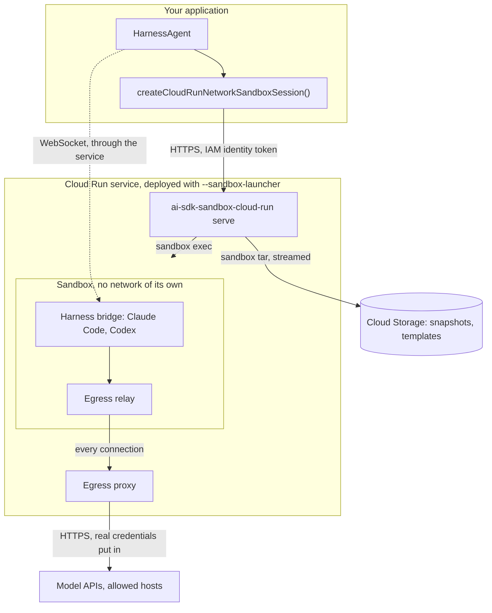
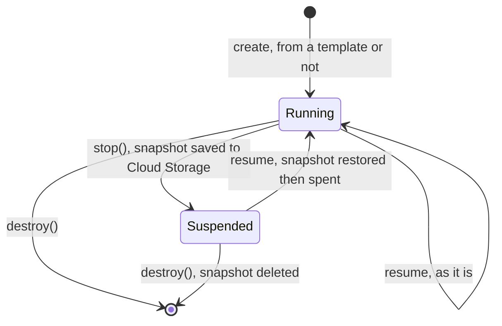
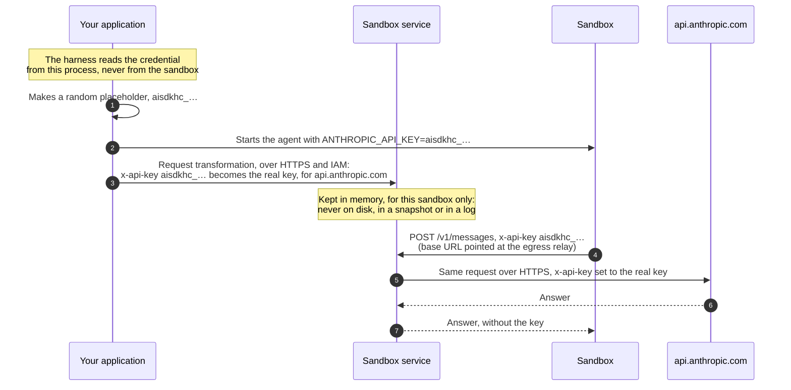
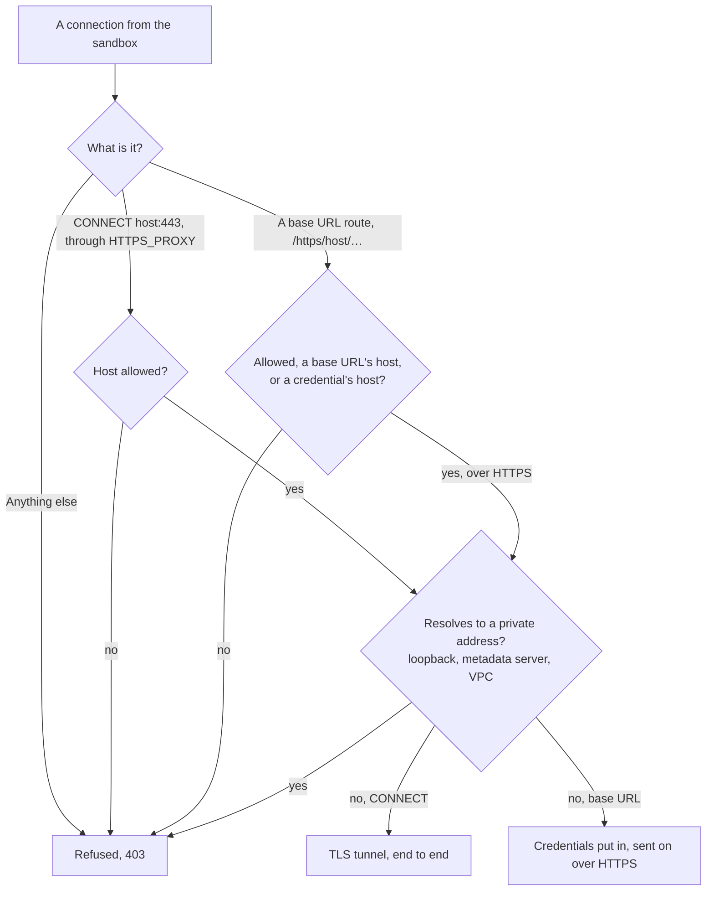

# ai-sdk-sandbox-cloud-run

<p align="center">
  <a href="https://www.npmjs.com/package/ai-sdk-sandbox-cloud-run"></a>
  <a href="https://github.com/fpasquet/ai-sdk-harness/actions/workflows/ci.yml"></a>
  
  
  <a href="https://github.com/fpasquet/ai-sdk-harness/blob/main/LICENSE"></a>
</p>

Run [AI SDK harness agents](https://ai-sdk.dev/docs/ai-sdk-harnesses/harness-agent) (Claude Code, Codex…) in [Cloud Run sandboxes](https://docs.cloud.google.com/run/docs/code-execution) on Google Cloud: one sandbox per session, nothing running and nothing billed between turns.

The package gives `HarnessAgent.createSession({ sandboxSession })` what it expects, a `HarnessV1NetworkSandboxSession`, the same way [`@ai-sdk/sandbox-vercel`](https://www.npmjs.com/package/@ai-sdk/sandbox-vercel) does for Vercel Sandbox and [`ai-sdk-sandbox-sbx`](https://www.npmjs.com/package/ai-sdk-sandbox-sbx) for Docker Sandboxes:

- **Scale to zero**: `stop()` saves the sandbox to a snapshot on Cloud Storage and frees it. With no sandbox running, the Cloud Run instance stops; the next resume brings the sandbox back in seconds.
- **No network of its own**: everything the sandbox sends goes through an egress proxy outside it, which only lets out the hosts you allow, over HTTPS.
- **Credentials stay outside**: the harness hands the sandbox a placeholder, and the proxy swaps the real value in on the way to the model API. A real credential never enters the sandbox, nor any log.
- **The harness is installed once**: pass `agent.getSandboxTemplate()` and the first sandbox is saved as a template; every later one starts from it.

## How it works

Cloud Run has no API for its sandboxes: they are started by a `sandbox` command line, inside the instances of a service deployed with `--sandbox-launcher`. This package therefore comes in two parts, the client your application calls and the sandbox service you deploy:



- **The client** (this package's API) creates, resumes, suspends and deletes sandboxes, and runs commands, files and ports through the service.
- **The sandbox service** (`ai-sdk-sandbox-cloud-run serve`) runs in your Cloud Run service and drives the `sandbox` CLI. Its image is also the root filesystem of every sandbox: a sandbox sees the image read-only, under a writable layer of its own. Put the tools your agent needs in it, and never a secret: every sandbox can read it.
- **The sandbox** has no network: everything it sends goes through its egress relay, a program the service starts in it, to the egress proxy of the service, outside the sandbox. That is where the hosts are allowed, and where the credentials are put in.

## Requirements

- Node.js 24 or later, on both sides.
- A Google Cloud project with Cloud Run and Cloud Storage, and the `gcloud` CLI to deploy.
- `@ai-sdk/harness` and a harness adapter, such as `@ai-sdk/harness-claude-code`.

## Deploying the sandbox service

### 1. The image

The image runs the service, and is what the sandboxes see. Start from this `Dockerfile` and add your agent's tools:

```dockerfile title="Dockerfile"
FROM node:24-bookworm-slim

# procps (pgrep) lets the service stop a process with everything it started.
RUN apt-get update \
  && apt-get install --yes --no-install-recommends ca-certificates curl git procps python3 ripgrep \
  && rm -rf /var/lib/apt/lists/* \
  && npm install --global --silent pnpm@10 ai-sdk-sandbox-cloud-run@0.1.0 \
  && npm cache clean --force

CMD ["ai-sdk-sandbox-cloud-run", "serve"]
```

Pin `ai-sdk-sandbox-cloud-run` to the version your application depends on. The client and the service check that they speak the same protocol, and the service refuses a client that does not, saying which version to deploy.

### 2. The bucket and the service account

```bash
PROJECT=my-project REGION=europe-west1 SERVICE=sandboxes
BUCKET=$PROJECT-sandboxes

# Snapshots and templates, in the service's region: no transfer is billed.
gcloud storage buckets create gs://$BUCKET --project=$PROJECT --location=$REGION \
  --uniform-bucket-level-access --public-access-prevention --soft-delete-duration=0

gcloud iam service-accounts create $SERVICE --project=$PROJECT
gcloud storage buckets add-iam-policy-binding gs://$BUCKET \
  --member=serviceAccount:$SERVICE@$PROJECT.iam.gserviceaccount.com --role=roles/storage.objectUser
```

The service account needs nothing but that role: the sandboxes never reach the metadata server, only the service does.

### 3. The service

```bash
gcloud beta run deploy $SERVICE --project=$PROJECT --region=$REGION --source=. \
  --sandbox-launcher --execution-environment=gen2 \
  --service-account=$SERVICE@$PROJECT.iam.gserviceaccount.com \
  --no-allow-unauthenticated \
  --min-instances=0 --max-instances=1 --cpu-throttling --cpu=2 --memory=4Gi \
  --timeout=3600 --concurrency=1000 \
  --set-env-vars=SNAPSHOT_BUCKET=$BUCKET,SANDBOX_ALLOWED_HOSTS=registry.npmjs.org,SANDBOX_IMAGE_ID=$(git rev-parse HEAD)
```

What these settings are for:

- `--sandbox-launcher` and `gen2` enable the `sandbox` CLI in the instance. The flag is only in the `beta` track of gcloud; with Terraform, set `launch_stage = "BETA"` on the service.
- `--max-instances=1`: a running sandbox lives in the memory of the instance that started it, and every call for it must reach that instance.
- `--min-instances=0 --cpu-throttling`: no instance and no bill while no sandbox runs.
- `--timeout=3600`: the longest a request lasts, so the longest a bridge WebSocket lasts. The harness reconnects beyond it.
- `--concurrency=1000`: every open bridge holds a request.
- `--memory`: see [Capacity](#capacity). 4 GiB runs two or three agent sandboxes at once.
- `SANDBOX_IMAGE_ID`: what the image is made of, a commit or a digest. Templates are tied to it; without it, to the Cloud Run revision, so every deployment makes them again.

### 4. Who may call it

Cloud Run's IAM only lets through the identities granted `roles/run.invoker`:

```bash
gcloud run services add-iam-policy-binding $SERVICE --project=$PROJECT --region=$REGION \
  --member=user:you@example.com --role=roles/run.invoker
```

Grant the service account of your application the same role when it runs on Google Cloud. Anyone with that role can run commands in every sandbox of the service: grant it to your application, not to people who only need to read logs.

For a second lock, should the service ever be deployed open by mistake, give it a shared secret, kept in Secret Manager, and hand the same to the client as `serviceToken`:

```bash
printf '%s' "$(openssl rand -hex 32)" | gcloud secrets create sandboxes-token --data-file=- --project=$PROJECT
gcloud secrets add-iam-policy-binding sandboxes-token --project=$PROJECT \
  --member=serviceAccount:$SERVICE@$PROJECT.iam.gserviceaccount.com --role=roles/secretmanager.secretAccessor
gcloud run services update $SERVICE --project=$PROJECT --region=$REGION \
  --set-secrets=SANDBOX_SERVICE_TOKEN=sandboxes-token:latest
```

### 5. The service's URL

The client needs the service's URL. Read it from Cloud Run rather than copying it around:

```bash
gcloud run services describe $SERVICE --project=$PROJECT --region=$REGION --format='value(status.url)'
```

The examples below read it from `CLOUD_RUN_SANDBOX_URL`.

## Installation

```bash
pnpm add ai-sdk-sandbox-cloud-run @ai-sdk/harness @ai-sdk/harness-claude-code
```

## Usage

```ts title="agent.ts"
import { HarnessAgent } from '@ai-sdk/harness/agent';
import { createClaudeCode } from '@ai-sdk/harness-claude-code';
import { createCloudRunNetworkSandboxSession } from 'ai-sdk-sandbox-cloud-run';

// Authenticated from CLAUDE_CODE_OAUTH_TOKEN or ANTHROPIC_API_KEY, which stay in this process.
const agent = new HarnessAgent({ id: 'coder', harness: createClaudeCode() });

const sandboxSession = await createCloudRunNetworkSandboxSession({
  // The service's URL: `gcloud run services describe` prints it.
  url: process.env.CLOUD_RUN_SANDBOX_URL!,
  // The Claude Code bridge listens on the first port; the harness reaches it through the service.
  ports: [4000],
  // The bridge installs its dependencies from npm.
  allowedHosts: ['registry.npmjs.org'],
  // Saves a sandbox with Claude Code installed the first time, reused afterwards.
  template: await agent.getSandboxTemplate(),
});
const session = await agent.createSession({ sandboxSession });

try {
  const result = await agent.generate({
    session,
    prompt: 'Write a script that prints the first ten primes, then run it.',
  });
  console.log(result.text);
} finally {
  await session.destroy();
  await sandboxSession.destroy();
}
```

Calls are authenticated with the gcloud CLI's account by default (`gcloud auth print-identity-token`). On Google Cloud, pass `auth: 'metadata'` to use the workload's service account; anywhere else, pass a function returning an identity token, such as one from `google-auth-library`:

```ts
import { GoogleAuth } from 'google-auth-library';

const url = process.env.CLOUD_RUN_SANDBOX_URL!;
const client = await new GoogleAuth().getIdTokenClient(url);

await createCloudRunNetworkSandboxSession({
  url,
  auth: () => client.idTokenProvider.fetchIdToken(url),
  ports: [4000],
});
```

## Templates

A harness bootstraps itself in the sandbox before its first turn: Claude Code installs `@anthropic-ai/claude-agent-sdk` and the `claude` CLI, which takes a minute or two. Pass the agent's template and it happens once:

```ts
const sandboxSession = await createCloudRunNetworkSandboxSession({
  url,
  ports: [4000],
  allowedHosts: ['registry.npmjs.org'],
  template: await agent.getSandboxTemplate(),
});
```

The first call creates a throwaway sandbox, runs `setup` in it, lets the harness prepare it, saves its writable layer to the bucket and deletes it. Every later sandbox starts from it. The template is named after a digest of the harness recipe and the `setup` commands, so a new harness version gets a template of its own.

A template is a layer over the service image, and is kept under `templates/<image>/`, `<image>` standing for this package's version, its Node.js and `SANDBOX_IMAGE_ID` (the Cloud Run revision without it). A template made on another image is never used: after a change to the image, the first sandbox makes the template again. Delete old folders of `templates/`, or let a lifecycle rule do it.

## Suspending and resuming

`stop()` suspends the sandbox: the processes this session started are stopped, the sandbox's writable layer is saved to `snapshots/<name>.tar.gz` and the sandbox is deleted from the instance. Resume it later, from this process or another one:



```ts
import {
  CloudRunSandboxNotFoundError,
  createCloudRunNetworkSandboxSession,
  resumeCloudRunNetworkSandboxSession,
} from 'ai-sdk-sandbox-cloud-run';

const settings = { url, ports: [4000], allowedHosts: ['registry.npmjs.org'] };

async function openSandbox(sandboxId: string) {
  try {
    const sandbox = await resumeCloudRunNetworkSandboxSession({ ...settings, sandboxId });
    // A previous run may have left a bridge behind, holding the port.
    await sandbox.killAllProcesses();
    return sandbox;
  } catch (error) {
    if (!(error instanceof CloudRunSandboxNotFoundError)) throw error;
    return createCloudRunNetworkSandboxSession({ ...settings, sandboxId });
  }
}
```

A running sandbox is resumed as it is; a suspended one is restored from its snapshot, which is then spent. Creation never resumes: a sandbox already named `sandboxId`, running or suspended, is a conflict. The service does not keep `ports`, `allowedHosts`, `baseUrls` nor credentials across a suspension: pass the settings again, and the harness hands its credentials over again when its session resumes.

**Suspend idle sandboxes yourself.** A sandbox lives in the memory of the instance; while a harness bridge stays connected to it, the instance serves a request and is billed, and it never scales to zero. Call `stop()` once a session has been idle for a few minutes, after `session.stop()` of the harness session, whose state lets `agent.createSession({ sessionId, resumeFrom })` pick the conversation up again. The [Next.js example](https://github.com/fpasquet/ai-sdk-harness/tree/main/examples/next-chat) does so after 5 minutes.

When Cloud Run stops the instance (`SIGTERM`, after a deployment or a scale-in), the service tries to save the sandboxes still running, but Cloud Run only waits 10 seconds: a sandbox with Claude Code and Codex installed, about 650 MB, takes some 20 seconds to save, and is lost. Suspend the sandboxes before deploying a new revision.

## Credentials

The real credentials of a harness, an API key or a subscription token, never enter the sandbox, where the agent could read them. The sandbox only ever sees a **placeholder**, a random `aisdkhc_…` string, and the service swaps the real value in on the request's way out, outside the sandbox. The agent can use the credential to call its API; it can never read it.

### How a credential travels



1. The harness reads the credential where your application keeps it: its environment, or the login of its CLI on your machine.
2. It makes a placeholder and starts the agent in the sandbox with it, in place of the credential.
3. It hands the service a request transformation: on a request to the API's host carrying the placeholder, put the real value instead. This is the one time the credential leaves your application, in the body of an HTTPS call that Cloud Run's IAM let through.
4. The service keeps the transformation in its memory, for that sandbox alone. No route reads it back.
5. To read a request, the proxy must see it before TLS: the API's client in the sandbox is pointed at the sandbox's egress relay, in plain HTTP on the sandbox's own loopback, through its base URL variable. `ANTHROPIC_BASE_URL=https://api.anthropic.com` becomes `http://127.0.0.1:3128/https/api.anthropic.com`.
6. The proxy, outside the sandbox, swaps the placeholder for the real value and sends the request on to the API over HTTPS. The answer comes back without it.

### Each way of signing in

| Harness and sign-in                                                             | What your application holds                                   | What the service is handed                                                               | What the sandbox sees               |
| ------------------------------------------------------------------------------- | ------------------------------------------------------------- | ---------------------------------------------------------------------------------------- | ----------------------------------- |
| Claude Code, API key (`ANTHROPIC_API_KEY`)                                      | The `sk-ant-…` key                                            | `x-api-key` for `api.anthropic.com`                                                      | `ANTHROPIC_API_KEY=aisdkhc_…`       |
| Claude Code, token (`ANTHROPIC_AUTH_TOKEN`)                                     | The token                                                     | `Authorization: Bearer` for `api.anthropic.com`                                          | `ANTHROPIC_AUTH_TOKEN=aisdkhc_…`    |
| Claude Code, Claude subscription (`CLAUDE_CODE_OAUTH_TOKEN`, or `claude` login) | The access token, and the refresh token of the `claude` login | The access token alone, as `Authorization: Bearer`                                       | `CLAUDE_CODE_OAUTH_TOKEN=aisdkhc_…` |
| Codex, API key (`OPENAI_API_KEY`)                                               | The `sk-…` key                                                | `Authorization: Bearer` for `api.openai.com`                                             | `CODEX_API_KEY=aisdkhc_…`           |
| Codex, ChatGPT subscription (`codex` login)                                     | The access token, the refresh token and the account id        | The access token as `Authorization: Bearer`, and `ChatGPT-Account-ID`, for `chatgpt.com` | `CODEX_API_KEY=aisdkhc_…`           |

With a subscription, the **refresh token never leaves your machine**: the harness refreshes the access token there, and only that short-lived token reaches the service. Codex signed in with ChatGPT sets its own base URL, `https://chatgpt.com/backend-api/codex`: the service routes a base URL a command sets the same way, so it still goes through the proxy.

The service routes `ANTHROPIC_BASE_URL` (Claude Code) and `OPENAI_BASE_URL` (Codex) by default. Add the base URL of another API with `baseUrls`:

```ts
await createCloudRunNetworkSandboxSession({
  url,
  baseUrls: { AI_GATEWAY_BASE_URL: 'https://ai-gateway.vercel.sh/v1' },
});
```

### What keeps a credential from leaking

| Protection                                 | What it prevents                                                                                                                                       |
| ------------------------------------------ | ------------------------------------------------------------------------------------------------------------------------------------------------------ |
| **Brokering is always on**                 | A harness falling back to forwarding the real credential into the sandbox: the sandbox session always takes request transformations.                   |
| **Commands carrying a credential refused** | A real credential entering the sandbox anyway: the service refuses any command whose command line or variables hold one it keeps for the sandbox.      |
| **Commands through a launcher**            | Credentials, variables or commands in Cloud Run's logs, which record the command line of everything run in a sandbox: that line is `node …/launch.js`. |
| **One host per credential**                | The credential reaching another host: it is only put in requests to the host it is for.                                                                |
| **HTTPS only**                             | The credential travelling in clear: a base URL in plain HTTP is refused.                                                                               |
| **No private address**                     | The sandbox reaching the metadata server, and the service account's token, or the service itself: see [Network](#network).                             |
| **Forgotten when done**                    | The credential outliving its use: `release()` and `stop()` drop it from the service's memory.                                                          |

### What remains true

- **The agent can use the credential, not read it.** It can call its API through the proxy, and so spend your quota: that is the point of brokering, the same as with Vercel Sandbox or Docker Sandboxes. It cannot take the value away to use it elsewhere.
- **The credential is in clear in three places**: your application, the service's memory, and the request to the API, encrypted end to end by HTTPS. A compromise of the service's container would expose the credentials of the sandboxes then running.
- **An API that echoed request headers back** would let the agent read the credential through it: the model APIs do not. This holds for any credential broker.
- **Your application's own logs** are yours to keep clean: it is the one holding the credentials.

## Network

The sandbox has no network of its own. Its only way out is the egress relay, a program the service starts in it, which carries every connection to the service's egress proxy, where each one is decided:



- `HTTPS_PROXY` points at the relay. The proxy tunnels a `CONNECT` to port 443 of an allowed host, end to end encrypted, and refuses anything else.
- The base URLs go through the relay to their API, as above.

`allowedHosts` adds hosts for one sandbox, on top of the service's `SANDBOX_ALLOWED_HOSTS`. `*.example.com` covers the subdomains of `example.com`. `setNetworkPolicy` replaces the sandbox's own hosts: `allow-all` lets it reach any host over HTTPS, `deny-all` none but the service's and the base URLs'. CIDR rules are not supported.

Whatever it allows, the proxy never connects to a private address: loopback, link-local (the metadata server, `169.254.169.254`), the private ranges of the VPC. It checks the address a name resolves to, at the moment it connects, so no name leads there either.

## Ports

`ports` lists the ports inside the sandbox the harness may reach. `getPortEndpoint()` returns a WebSocket URL on the service, `wss://<service>/v1/sandboxes/<name>/ports/<port>`, with the identity token as a header, read anew at each connection, and the service token if any. The service passes the connection on to `127.0.0.1:<port>` in the sandbox, without the caller's headers that let it through. A port outside the list is refused with `HarnessCapabilityUnsupportedError`.

## Lifecycle

| Method                     | What it does                                                                                      |
| -------------------------- | ------------------------------------------------------------------------------------------------- |
| `release()`                | Stops the processes this session started and forgets its credentials, leaving the sandbox running |
| `killAllProcesses()`       | Stops every process any session started in the sandbox, including what a previous run left behind |
| `stop()`                   | Suspends the sandbox: snapshot on Cloud Storage, sandbox freed. Idempotent                        |
| `destroy()`                | Deletes the sandbox and its snapshot. Idempotent                                                  |
| `setNetworkPolicy(policy)` | Replaces the hosts the sandbox may reach                                                          |
| `restricted()`             | The files-and-processes view of the same sandbox, to hand to tools                                |
| `fork({ ports })`          | Another view of the same sandbox, with ports, processes and credentials of its own (see below)    |

`restricted()` returns an `Experimental_SandboxSession`: it can run commands and read and write files, but cannot suspend the sandbox, reach its ports or touch credentials. Pass it to AI SDK tools that accept `experimental_sandbox`.

### Several sessions in one sandbox

A bridge-backed harness, Claude Code or Codex, listens on the first port of the sandbox session it is given. To run several harness sessions side by side in one sandbox, give each its own view with `fork({ ports })`: the same sandbox and files, and a port of its own for its bridge.

```ts
const first = await agent.createSession({ sandboxSession: sandbox.fork({ ports: [4001] }) });
const second = await agent.createSession({ sandboxSession: sandbox.fork({ ports: [4002] }) });
```

A view starts its own processes and hands its own credentials to the service, and its `release()` only touches them: releasing one session leaves the others running. Its `setRequestTransformations()` replaces its own credentials only. `stop()` and `destroy()` act on the whole sandbox, from any view: suspend it once no session uses it. [`ai-sdk-harness-sessions`](https://ai-sdk-harness.pages.dev/docs/packages/harness-sessions) hands out the ports, releases the views and suspends the sandbox for you.

## Options

`createCloudRunNetworkSandboxSession(options)` takes every option below; `resumeCloudRunNetworkSandboxSession(options)` takes `sandboxId`, `abortSignal` and the connection settings.

| Option         | Default        | Description                                                                                         |
| -------------- | -------------- | --------------------------------------------------------------------------------------------------- |
| `url`          | required       | _Connection._ The URL of the sandbox service                                                        |
| `auth`         | `'gcloud'`     | _Connection._ `'gcloud'`, `'metadata'`, `'none'`, or a function returning an identity token         |
| `ports`        | `[]`           | _Connection._ Ports the harness may reach, through the service                                      |
| `allowedHosts` | `[]`           | _Connection._ Hosts the sandbox may reach over HTTPS, on top of the service's                       |
| `baseUrls`     | `{}`           | _Connection._ Base URL variables routed through the service, on top of its own                      |
| `serviceToken` | none           | _Connection._ The service's `SANDBOX_SERVICE_TOKEN`, when it has one                                |
| `sandboxId`    | `ai-sdk-<hex>` | The sandbox's name: lowercase letters, digits and dashes, 63 at most. Creation fails if it is taken |
| `template`     | none           | `await agent.getSandboxTemplate()`: prepare once, start every later sandbox from it                 |
| `setup`        | `[]`           | Commands run once after creation, as root, saved in the template                                    |
| `abortSignal`  | none           | Aborts the creation or the resume                                                                   |

## Service configuration

The service reads its settings from the environment. Every variable has a default fit for Cloud Run.

| Variable                        | Default                                                                                  | Description                                                                               |
| ------------------------------- | ---------------------------------------------------------------------------------------- | ----------------------------------------------------------------------------------------- |
| `SNAPSHOT_BUCKET`               | required on Cloud Run                                                                    | The bucket of the snapshots and templates                                                 |
| `SANDBOX_ALLOWED_HOSTS`         | none                                                                                     | Hosts every sandbox may reach over HTTPS, comma-separated; `*.domain` allowed             |
| `SANDBOX_BASE_URLS`             | `ANTHROPIC_BASE_URL=https://api.anthropic.com,OPENAI_BASE_URL=https://api.openai.com/v1` | Base URL variables routed through the service, as `NAME=url` pairs                        |
| `SANDBOX_HOME`                  | `/home/agent`                                                                            | The `HOME` of the sandboxes' commands                                                     |
| `SANDBOX_WORKDIR`               | `/workspace`                                                                             | Their working directory                                                                   |
| `SANDBOX_PATH`                  | `/usr/local/sbin:/usr/local/bin:/usr/sbin:/usr/bin:/sbin:/bin`                           | Their `PATH`                                                                              |
| `SANDBOX_EGRESS_PORT`           | `3128`                                                                                   | The port of the egress relay in each sandbox                                              |
| `SANDBOX_IMAGE_ID`              | the Cloud Run revision                                                                   | What the image is made of, a commit or a digest: templates are tied to it                 |
| `SANDBOX_SERVICE_TOKEN`         | none                                                                                     | A secret every call must carry, beside Cloud Run's IAM                                    |
| `SANDBOX_ALLOW_EGRESS`          | `false`                                                                                  | `true` gives the sandboxes a network of their own (`--allow-egress`), beyond the proxy    |
| `SANDBOX_ALLOW_PRIVATE_NETWORK` | `false`                                                                                  | Off Cloud Run only, for tests: lets the sandboxes reach private addresses and plain HTTP  |
| `SNAPSHOT_TRANSFER`             | `fifo`                                                                                   | `file` to pass layers through a file rather than a pipe; the service falls back by itself |
| `SANDBOX_CLI`                   | `/usr/local/gcp/bin/sandbox`                                                             | The `sandbox` CLI                                                                         |
| `SANDBOX_NODE`                  | the service's Node.js                                                                    | The Node.js the sandboxes run the relay with                                              |
| `SNAPSHOT_DIRECTORY`            | `.snapshots`                                                                             | Off Cloud Run, without a bucket: the directory of the snapshots                           |
| `PORT`, `HOST`                  | `8080`, `0.0.0.0` on Cloud Run and `127.0.0.1` elsewhere                                 | Where the service listens                                                                 |
| `LOG_FORMAT`                    | `json` on Cloud Run, `text` elsewhere                                                    | JSON lines for Cloud Logging, or plain text                                               |

A sandbox's commands run with nothing of the service's environment: only their `PATH`, `HOME`, proxy and base URL variables, `IS_SANDBOX=1` (a Cloud Run sandbox runs as root), `npm_config_side_effects_cache=false` (pnpm's side-effects cache crashes a Cloud Run sandbox, the Claude Code bridge's install included) and the variables the command sets.

## Docker and docker compose

**Docker cannot run in a Cloud Run sandbox, so neither can `docker compose`.** The sandbox is a gVisor container that may not mount file systems, create namespaces or use cgroups: the Docker daemon stops at once (`failed to start daemon: Devices cgroup isn't mounted`), whatever the image holds or however it is configured. Running a container without Docker fails too: PRoot, which fakes a root file system in user space, loses track of the processes a program starts.

Services can still run as plain processes of the sandbox, installed in the service's image and started by `setup` or by the agent, on the sandbox's loopback: MongoDB, Redis or RabbitMQ, say. Not PostgreSQL, which refuses to run as root, while a Cloud Run sandbox runs as root and cannot switch users. And not a project's `docker-compose.yml` as it is.

For a project whose tests need containers, use [`ai-sdk-sandbox-sbx`](https://www.npmjs.com/package/ai-sdk-sandbox-sbx): every Docker Sandbox has a Docker daemon of its own, and `docker compose up` works in it.

## Capacity

Every running sandbox holds its writable layer in the instance's memory: what the harness installed, and what the agent wrote. Measured on Cloud Run with Claude Code and Codex installed by a template, a layer of about 650 MB:

| With 2 vCPU and 4 GiB                | Measured                                                |
| ------------------------------------ | ------------------------------------------------------- |
| Creating the template, once          | about 1 minute                                          |
| Starting a sandbox from the template | 10 to 14 seconds                                        |
| Suspending it (`stop()`)             | about 20 seconds                                        |
| Resuming it                          | about 10 seconds                                        |
| Sandboxes running at once            | 5 started; from the third, some took 2 minutes to start |

Give the instance about 1 GiB per agent sandbox that may run at once, and 8 GiB beyond two or three. Suspended sandboxes take no memory.

## Cost

With the deployment above, the instance is only billed while it serves a request, and an open harness bridge is one: a session at work costs 2 vCPU and 4 GiB, about $0.21 an hour in `europe-west1` beyond the monthly free tier, which covers about 25 hours. An idle session whose bridge stays connected is billed the same: suspend it. A suspended sandbox only costs its snapshot's storage. Check the current [Cloud Run pricing](https://cloud.google.com/run/pricing).

To keep the bill down, suspend idle sandboxes early, destroy finished ones, and add a lifecycle rule deleting old objects from the bucket. A sandbox whose snapshot was deleted can no longer be resumed.

## Security

- **The sandbox sees the image, not the instance**: neither the service's environment nor the metadata server, so not the service account's token.
- **Nothing leaves the sandbox but through the proxy**, which only opens allowed hosts and the base URLs' APIs, and never a private address.
- **The real credentials** never enter the sandbox, a snapshot or a log: see [Credentials](#credentials). Keep them out of the image too: everything in it is readable from every sandbox.
- **The service trusts its callers**: anyone granted `roles/run.invoker` can run commands in any sandbox. Never deploy it with `--allow-unauthenticated`; add `SANDBOX_SERVICE_TOKEN` as a second lock.
- **Snapshots hold the sandbox's files**: the agent's work and its transcript. Keep the bucket private, and readable by the service account alone.
- **Commands are not logged**: Cloud Run logs the launcher's command line only. Your application's own logs are yours to keep clean: it is the one holding the credentials.
- **The harness's bridge token** is in the URL of its WebSocket, which Cloud Run logs with every request. It only opens the bridge of one sandbox, to someone who may already call the service, and dies with the bridge.

## Errors

- `CloudRunSandboxNotFoundError`: `resumeCloudRunNetworkSandboxSession()` found no sandbox of that name, running or suspended. Carries `sandboxId`.
- `CloudRunSandboxServiceError`: the service answered with an error status, such as 409 for a name already taken, or 400 for a client speaking another protocol than the service, or a command carrying a credential. Carries `request` and `status`.
- `HarnessSandboxAuthenticationError` (from `@ai-sdk/harness`): Cloud Run refused the call (401 or 403), or the service token is missing or wrong.
- `HarnessCapabilityUnsupportedError` (from `@ai-sdk/harness`): a port that is not exposed, or a network policy with CIDR rules.

## Limitations

- **One instance.** The running sandboxes share the memory of one instance, writable layers included, which bounds how many run at once: see [Capacity](#capacity). Suspended ones do not count.
- **A stopped instance loses the running sandboxes.** A crash, and most stops Cloud Run announces (`SIGTERM`, 10 seconds before it kills the instance), leave no time to save an agent sandbox of hundreds of megabytes. Suspend sandboxes when they are idle, and before deploying.
- **32 MiB per request.** Cloud Run limits HTTP/1 request bodies: a larger file cannot be written in one call.
- **A process's output stops after an hour**, the request timeout. Its exit code is still found.
- **HTTPS only.** The proxy only tunnels to port 443: no plain HTTP but through a base URL, no SSH, no `git` over SSH.
- **No Docker, no `docker compose`, no PostgreSQL** in the sandbox: see [Docker and docker compose](#docker-and-docker-compose). Use `ai-sdk-sandbox-sbx` for projects that need containers.
- **`/tmp` is not part of a snapshot.**
- **pnpm's side-effects cache is off** in the sandboxes (`npm_config_side_effects_cache=false`): it crashes a Cloud Run sandbox.
- **One bridge per port.** Run one harness session at a time per sandbox view, and give each session a view of its own with `fork()`.

## Development

This package lives in the [`ai-sdk-harness`](https://github.com/fpasquet/ai-sdk-harness) monorepo.

- `pnpm test` runs the client against the real service, itself running over a fake `sandbox` CLI that isolates nothing.
- `pnpm test:e2e` runs against a service deployed on Cloud Run. Set `CLOUD_RUN_SANDBOX_URL` to its URL, sign gcloud in with an account granted `roles/run.invoker`, and set `CLOUD_RUN_SANDBOX_SERVICE_TOKEN` if the service has a token.

To prove that a credential is put in on the way out of the sandbox, and never inside it, the e2e suite needs a host that sends back the headers it received: it calls `https://postman-echo.com/headers`, Postman's public echo API, with a fake credential made for the test. The package itself never calls it.

## License

[MIT](https://github.com/fpasquet/ai-sdk-harness/blob/main/LICENSE)
