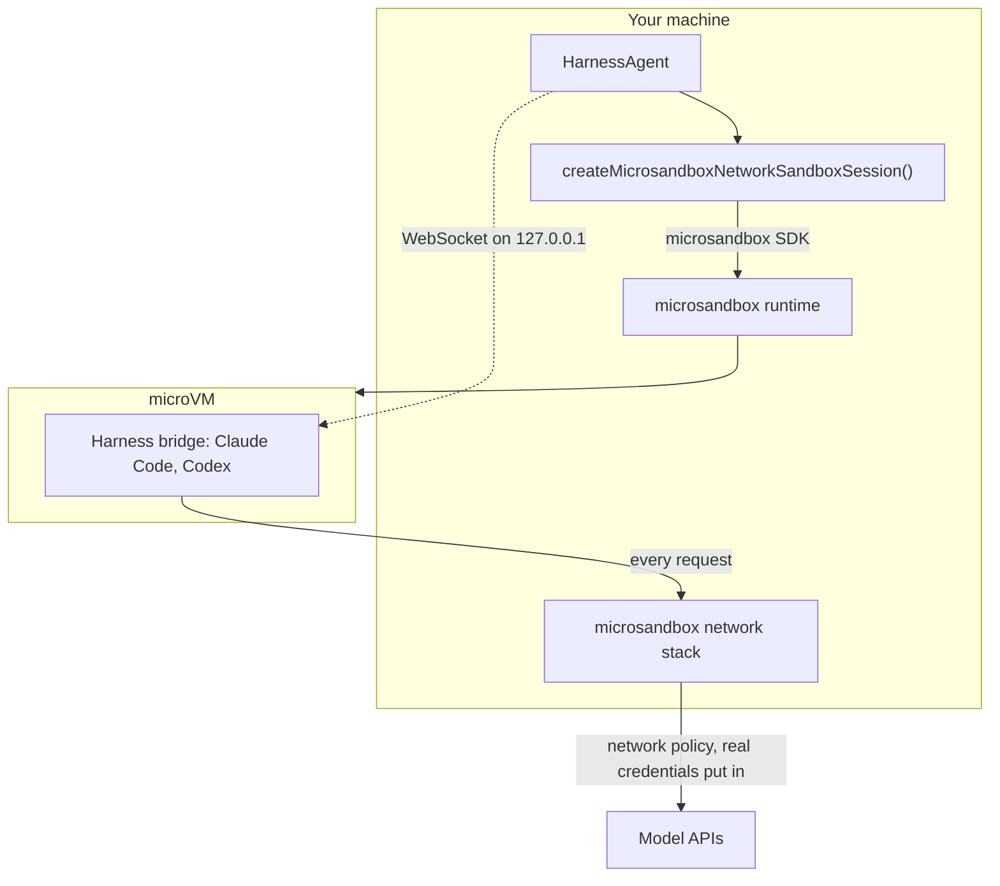
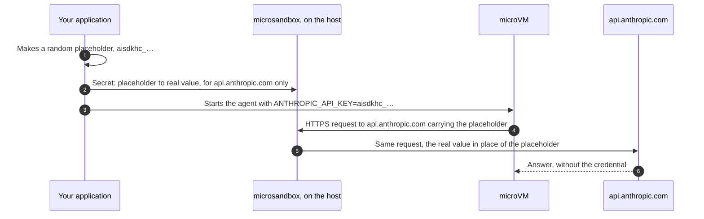

# ai-sdk-sandbox-microsandbox

<p align="center">
  <a href="https://www.npmjs.com/package/ai-sdk-sandbox-microsandbox"></a>
  <a href="https://github.com/fpasquet/ai-sdk-harness/actions/workflows/ci.yml"></a>
  
  
  <a href="https://github.com/fpasquet/ai-sdk-harness/blob/main/LICENSE"></a>
</p>

Run [AI SDK harness agents](https://ai-sdk.dev/docs/ai-sdk-harnesses/harness-agent) (Claude Code, Codex, OpenCode…) in a [microsandbox](https://github.com/superradcompany/microsandbox): a microVM with a Linux kernel of its own, booted from any OCI image on your machine in a few hundred milliseconds, driven through the `microsandbox` SDK. No daemon, no account.

The package gives `HarnessAgent.createSession({ sandboxSession })` what it expects, a `HarnessV1NetworkSandboxSession`, the same way [`@ai-sdk/sandbox-vercel`](https://www.npmjs.com/package/@ai-sdk/sandbox-vercel) does for Vercel Sandbox:

- **Isolation**: every command and file operation runs in the microVM, hardware-isolated by KVM or Apple's Hypervisor framework. Nothing runs on the host, and nothing of the host is mounted unless you ask for it.
- **Credentials stay out of the sandbox**: the harness hands the sandbox a placeholder; microsandbox's network stack swaps the real value in on the way out, for the API's host only.
- **The harness is installed once**: pass `agent.getSandboxTemplate()` and the first sandbox is saved as a disk snapshot; every later one is restored from it in a fraction of a second.
- **Any image**: `node:24` by default, or the image your project builds with.

> This package is in its **0.x** series: try it, and tell what works and what does not in the [issues](https://github.com/fpasquet/ai-sdk-harness/issues). Until 1.0.0, a minor release may break its API, and its changelog says how; a patch release never does. The AI SDK harnesses it plugs into are themselves experimental, and so is microsandbox. It is a community package, not affiliated with Vercel or with microsandbox.

## How it works



Every command and file operation goes to the agent microsandbox runs inside the microVM, and every connection the sandbox opens leaves through microsandbox's network stack on the host, which applies the network policy and puts the credentials in.

## Requirements

- Node.js 24 or later.
- Linux with KVM (your user needs read-write access to `/dev/kvm`), or macOS on Apple Silicon.
- `@ai-sdk/harness` and a harness adapter, such as `@ai-sdk/harness-claude-code`.

The runtime (`msb` and `libkrunfw`) comes with the `microsandbox` npm package this package depends on: nothing else to install. If you also installed the `msb` CLI, its runtime in `~/.microsandbox` takes precedence, and the SDK only launches a runtime of its own version: keep both on the same version (`msb --version`, `msb self update`), or the creation fails with `no tested sandbox launch contract for runtime …`. `msb doctor` checks the host.

## Installation

```bash
pnpm add ai-sdk-sandbox-microsandbox @ai-sdk/harness @ai-sdk/harness-claude-code
```

## Usage

```ts title="agent.ts"
import { HarnessAgent } from '@ai-sdk/harness/agent';
import { createClaudeCode } from '@ai-sdk/harness-claude-code';
import { createMicrosandboxNetworkSandboxSession } from 'ai-sdk-sandbox-microsandbox';

// Authenticated from CLAUDE_CODE_OAUTH_TOKEN or ANTHROPIC_API_KEY.
const agent = new HarnessAgent({ id: 'coder', harness: createClaudeCode() });

const sandboxSession = await createMicrosandboxNetworkSandboxSession({
  // The Claude Code bridge listens on the first port; the harness reaches it on the loopback.
  ports: [4000],
  // The bridge installs its dependencies with pnpm, which the node image does not ship.
  setup: ['npm install --global --silent pnpm@10'],
  // Saves Claude Code in a snapshot the first time, restored afterwards.
  template: await agent.getSandboxTemplate(),
});
const session = await agent.createSession({ sandboxSession });

try {
  const result = await agent.generate({
    session,
    prompt: 'Write a script that prints the first ten primes, then run it.',
  });
  console.log(result.text);
} finally {
  await session.destroy();
  await sandboxSession.destroy();
}
```

The caller owns the sandbox: it runs detached, and ending the harness session, or this process, leaves it running. `stop()` stops its microVM and keeps its disk; `destroy()` removes it.

`agent.stream()` works the same way, and its result's `toUIMessageStreamResponse()` feeds `useChat` straight away. The [Next.js example](https://github.com/fpasquet/ai-sdk-harness/tree/main/examples/next-chat) is a complete chat on top of it, with `EXAMPLE_SANDBOX=microsandbox`.

## Images and users

The microVM boots from an OCI image, pulled from its registry the first time and cached afterwards. The default, `node:24`, ships Node.js for the harness and git, curl and Python for the agent. Any image with Node.js does:

```ts
await createMicrosandboxNetworkSandboxSession({
  image: 'ghcr.io/acme/build-image:latest',
  user: 'builder',
  ports: [4000],
});
```

Commands run as `node`, the unprivileged user of the `node` images, or as the image's own user with any other `image`, unless `user` says otherwise. Run the harness as an unprivileged user: Claude Code refuses to skip its permission prompts as `root`. The `setup` commands run as `root`, so they can install what the harness needs.

## Templates

A harness bootstraps itself in the sandbox before its first turn: Claude Code installs `@anthropic-ai/claude-agent-sdk` and the `claude` CLI. Pass the agent's template and it happens once:

```ts
const sandboxSession = await createMicrosandboxNetworkSandboxSession({
  ports: [4000],
  setup: ['npm install --global --silent pnpm@10'],
  template: await agent.getSandboxTemplate(),
});
```

The first call creates a throwaway sandbox, runs `setup` in it, lets the harness prepare it, stops it, saves its disk as a snapshot and removes it. The snapshot is named `ai-sdk-harness-template-<digest>`, the digest covering the harness recipe, the image, the user and the `setup` commands, so a new harness version gets a snapshot of its own. Every later sandbox is restored from it, with its own resources, ports and mounts.

The snapshots stay in microsandbox's store: list them with `msb snapshot ls`, remove an outdated one with `msb snapshot rm`.

## Resuming a sandbox

Creation never resumes: a sandbox already named `sandboxId` is a conflict. Name the sandbox, keep its id, and reattach to it, from the same process or another one:

```ts
import {
  createMicrosandboxNetworkSandboxSession,
  MicrosandboxSandboxNotFoundError,
  resumeMicrosandboxNetworkSandboxSession,
} from 'ai-sdk-sandbox-microsandbox';

async function openSandbox() {
  try {
    return await resumeMicrosandboxNetworkSandboxSession({ sandboxId: 'my-agent' });
  } catch (error) {
    if (!(error instanceof MicrosandboxSandboxNotFoundError)) throw error;
    return createMicrosandboxNetworkSandboxSession({ sandboxId: 'my-agent', ports: [4000] });
  }
}
```

A stopped sandbox starts again on resume. microsandbox remembers the ports a sandbox was created with: resuming needs none. A command ends with the process that started it, so nothing a previous run of your application started is left running in the sandbox.

## Working on your files

By default the sandbox mounts nothing of the host: the agent works on the microVM's own disk, in `/workspace`. Mount a directory there to let it work on yours:

```ts
// Read-write: the agent edits the directory itself.
await createMicrosandboxNetworkSandboxSession({ workspace: '/path/to/project', ports: [4000] });
```

The sandbox's working directory (`defaultWorkingDirectory`, under which the harness creates each session's own directory) is `/workspace` either way. A mounted directory keeps the owner it has on the host: give the sandbox's user the right to write in it.

## Credentials

A harness that supports credential brokering never puts the real credential in the sandbox. It hands the sandbox a random placeholder, an `aisdkhc_…` string, and asks the sandbox session to transform the requests on their way out. This package turns each transformation into a microsandbox secret, allowed for the API's host only: microsandbox's network stack, outside the microVM, then puts the real value in the requests to that host. The agent can use the credential to call its API; it cannot read it.



| Harness and sign-in                                                             | What the sandbox sees               | What microsandbox is given                                  |
| ------------------------------------------------------------------------------- | ----------------------------------- | ----------------------------------------------------------- |
| Claude Code, API key (`ANTHROPIC_API_KEY`)                                      | `ANTHROPIC_API_KEY=aisdkhc_…`       | The key, for `api.anthropic.com`                            |
| Claude Code, Claude subscription (`CLAUDE_CODE_OAUTH_TOKEN`, or `claude` login) | `CLAUDE_CODE_OAUTH_TOKEN=aisdkhc_…` | The access token alone: the refresh token stays on the host |
| Codex, API key (`OPENAI_API_KEY`)                                               | `CODEX_API_KEY=aisdkhc_…`           | The key, for `api.openai.com`                               |
| Codex, ChatGPT subscription (`codex` login)                                     | `CODEX_API_KEY=aisdkhc_…`           | The access token, for `chatgpt.com`                         |

To put a secret in an HTTPS request, microsandbox intercepts TLS: every sandbox this package creates trusts microsandbox's own certificate authority, through the system store and `NODE_EXTRA_CA_CERTS`, `SSL_CERT_FILE` and `REQUESTS_CA_BUNDLE`. A tool that ships its own list of authorities and ignores those cannot reach HTTPS hosts. With Codex logged in with ChatGPT, the harness asks for a `ChatGPT-Account-ID` header microsandbox cannot add, since it only swaps placeholders: it is left out with a warning, and Codex works without it.

Where the real value lives:

- **On the host**, where your application reads it, and **in microsandbox's database** (`~/.microsandbox/db`, or `$MSB_HOME/db`), readable by your user, from which its network stack reads the secrets of a sandbox. Removing the secret, or the sandbox, deletes its row; SQLite may keep the bytes in its file until the space is reused. Run the application under a user of its own, on a host of its own.
- **Never in the sandbox**, its disk or its template. The sandbox sees the placeholder, in the variable the harness sets and in one microsandbox adds, named `AISDK_<HOST>_<HEADER>`.

A secret with a new placeholder restarts the microVM, in well under a second, since microsandbox cannot hand one to the processes already running. The harness adds its credentials before it starts its bridge, and keeps the same placeholders when a session resumes, which only rotates the values, live. The secrets are withdrawn by `release()` and `stop()`, and removed with the sandbox by `destroy()`.

Brokering can be turned off with `brokerCredentials: false`: the harness then forwards the **real credential** into the sandbox environment, where the agent can read it. Keep it on.

Variables a command does set travel to the sandbox with the command, on microsandbox's own channel: they never appear on a command line, nor in microsandbox's logs.

## Network

Without a `networkPolicy`, microsandbox's default applies: the sandbox reaches the public internet, but no private, loopback or link-local address of the host's networks. Restrict it at creation with the harness's own policy type:

```ts
await createMicrosandboxNetworkSandboxSession({
  ports: [4000],
  networkPolicy: {
    mode: 'custom',
    allowedHosts: ['api.anthropic.com', 'registry.npmjs.org', '*.github.com'],
    deniedCIDRs: ['169.254.169.254/32'],
  },
});
```

`custom` allows the listed hosts and blocks only, a `*.example.com` entry standing for the domain and its subdomains, and `deniedCIDRs` win over everything. `deny-all` blocks every connection out of the sandbox, `allow-all` allows them all, private addresses included. Hosts are matched on the name the sandbox asks for, through microsandbox's DNS and TLS interception: list the model API and every registry the harness and the agent need. The policy is fixed at creation: `setNetworkPolicy` is not implemented, which the harness treats as optional.

## Ports

`ports` lists the ports inside the sandbox the harness may reach. microsandbox publishes them when it creates the sandbox, each on a free port of this host's loopback (`127.0.0.1:<free port>`), and never on another interface. `getPortEndpoint()` resolves them; `setPorts()` can narrow them, but a port the sandbox was not created with is refused with `HarnessCapabilityUnsupportedError`, like any port outside the list.

## Lifecycle

| Method               | What it does                                                                          |
| -------------------- | ------------------------------------------------------------------------------------- |
| `release()`          | Stops the processes this session started and withdraws its secrets                    |
| `killAllProcesses()` | Stops every process started through this session or its restricted views              |
| `stop()`             | `release()`, then stops the microVM. Its disk stays; the next command starts it again |
| `destroy()`          | Removes the sandbox, its disk and its secrets                                         |
| `restricted()`       | The files-and-processes view of the same sandbox, to hand to tools (see below)        |

`restricted()` returns an `Experimental_SandboxSession`: it can run commands and read and write files, but cannot stop the sandbox or touch credentials. Pass it to AI SDK tools that accept `experimental_sandbox`.

microsandbox keeps what the commands print in `exec.log`, next to the sandbox's disk (`msb logs <id>`), until the sandbox is removed.

## Options

`createMicrosandboxNetworkSandboxSession(options)` takes every option below; `resumeMicrosandboxNetworkSandboxSession(options)` takes `sandboxId`, `abortSignal` and `brokerCredentials`.

| Option              | Default                  | Description                                                                                     |
| ------------------- | ------------------------ | ----------------------------------------------------------------------------------------------- |
| `sandboxId`         | `ai-sdk-<hex>`           | The sandbox's name in `msb ls`. Creation fails if it is taken                                   |
| `template`          | none                     | `await agent.getSandboxTemplate()`: prepare once, restore every later sandbox from the snapshot |
| `abortSignal`       | none                     | Aborts the creation or the resume                                                               |
| `image`             | `'node:24'`              | The OCI image the microVM boots from                                                            |
| `user`              | `'node'`, or the image's | Who the commands run as, but `setup`                                                            |
| `ports`             | `[]`                     | Ports the harness may reach, published on the loopback at creation                              |
| `cpus`              | `2`                      | vCPUs of the microVM                                                                            |
| `memory`            | `2048`                   | Memory of the microVM, in MiB                                                                   |
| `workspace`         | none                     | Host directory to mount read-write at `/workspace`, the working directory                       |
| `networkPolicy`     | public internet only     | What the sandbox may reach: `allow-all`, `deny-all` or `custom`                                 |
| `setup`             | `[]`                     | Commands run once after creation, as `root`, baked into the template                            |
| `brokerCredentials` | `true`                   | _Connection._ Keep credentials out of the sandbox, put in by microsandbox's network stack       |

## Errors

- `MicrosandboxSandboxNotFoundError`: `resumeMicrosandboxNetworkSandboxSession()` found no sandbox of that name. Carries `sandboxId`.
- `MicrosandboxCommandError`: a `setup` command, or a step of the creation, exited with a non-zero status. Carries `command`, `exitCode` and `stderr`. The half-made sandbox is removed.
- `HarnessCapabilityUnsupportedError` (from `@ai-sdk/harness`): a port that is not exposed, or a credential microsandbox cannot broker.
- The errors of the `microsandbox` SDK (`MicrosandboxError` and its subclasses) come through as they are: a missing runtime, a host without KVM, an image that cannot be pulled.

## Limitations

- **One bridge per port.** A bridge-backed harness listens on the first port: run one harness session at a time per sandbox, or give each its own port.
- **Ports and the network policy are fixed at creation.** microsandbox cannot publish a port, or change the policy, of an existing sandbox.
- **A sandbox restored from a template intercepts TLS from its first credential on**: until then, a `custom` network policy cannot match HTTPS hosts. The harness adds its credential before its first request, so this only matters to the commands you run before it.

## Development

This package lives in the [`ai-sdk-harness`](https://github.com/fpasquet/ai-sdk-harness) monorepo. `pnpm test` runs the unit tests against a fake `microsandbox` SDK that runs commands on the host; `pnpm test:e2e` runs them against the real runtime, creating and removing microVMs on your machine.

## License

[MIT](https://github.com/fpasquet/ai-sdk-harness/blob/main/LICENSE)
