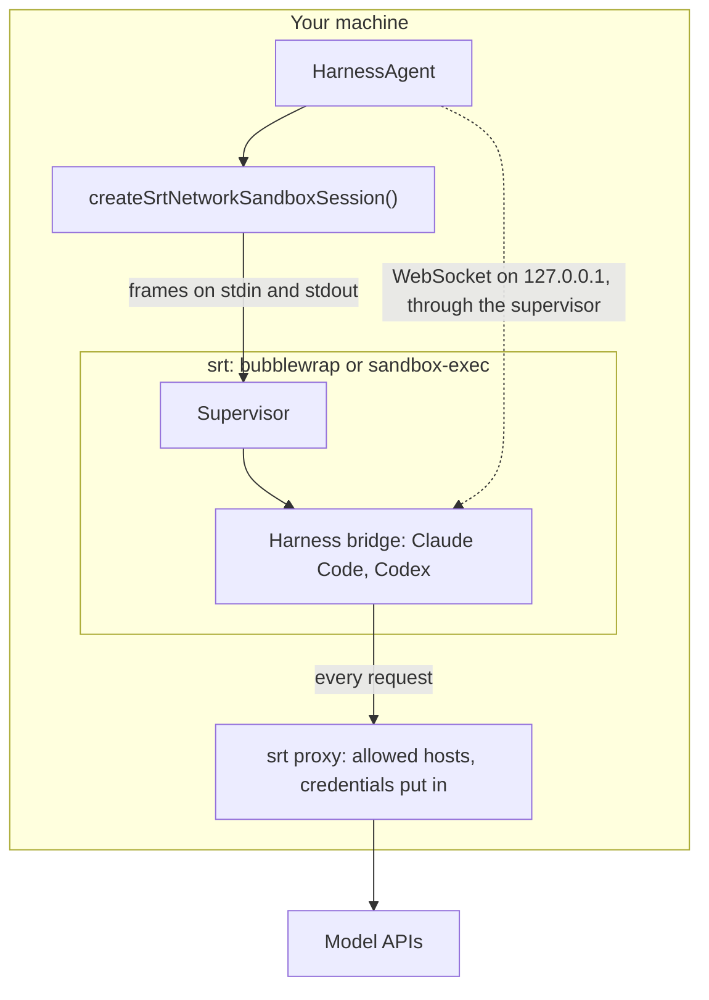
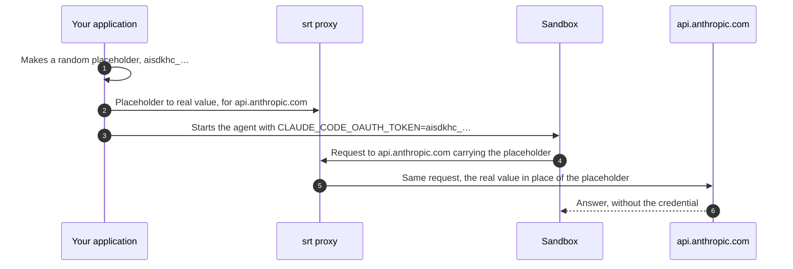

# ai-sdk-sandbox-runtime

<p align="center">
  <a href="https://www.npmjs.com/package/ai-sdk-sandbox-runtime"></a>
  <a href="https://github.com/fpasquet/ai-sdk-harness/actions/workflows/ci.yml"></a>
  
  
  <a href="https://github.com/fpasquet/ai-sdk-harness/blob/main/LICENSE"></a>
</p>

Run [AI SDK harness agents](https://ai-sdk.dev/docs/ai-sdk-harnesses/harness-agent) (Claude Code, Codex, OpenCode…) on your own machine, fenced by the operating system, with no container and no virtual machine: [Anthropic Sandbox Runtime](https://github.com/anthropics/sandbox-runtime) (srt), the sandbox Claude Code puts around its own commands, put around the whole agent.

The package gives `HarnessAgent.createSession({ sandboxSession })` what it expects, a `HarnessV1NetworkSandboxSession`, like [`ai-sdk-sandbox-sbx`](https://www.npmjs.com/package/ai-sdk-sandbox-sbx) does for Docker Sandboxes:

- **Fenced by the kernel**: srt runs the sandbox under [bubblewrap](https://github.com/containers/bubblewrap) on Linux and `sandbox-exec` on macOS. The agent reads the host but your home directory, writes its own directory and its workspace only, and reaches the hosts you allow, nothing else.
- **Credentials stay out**: the sandbox holds a placeholder; srt's proxy puts the real value in the requests to the model's API.
- **Starts in milliseconds**: nothing to pull or boot. A command runs in a few milliseconds, and the agent works on your files where they are.
- **Your machine's tools**: the agent uses the Node.js, git and compilers of the host, read-only.

> This package is in its **0.x** series, and srt is itself a research preview: try it, and tell what works and what does not in the [issues](https://github.com/fpasquet/ai-sdk-harness/issues). Until 1.0.0, a minor release may break its API, and its changelog says how; a patch release never does. It is a community package, not affiliated with Vercel or Anthropic.

## How it works



Each sandbox is one process srt wraps, a small supervisor: every command, file operation and connection of the sandbox goes through it, on its standard input and output. Its processes share one filesystem view and, on Linux, one network namespace of their own, whose loopback the harness bridge listens on: the package forwards the bridge's port to a free port of this host's loopback. Every request a process makes leaves through srt's proxy, which only lets the allowed hosts through and puts the credentials in.

## Requirements

- Node.js 24 or later, on **Linux** or **macOS**. Windows is not supported.
- `@ai-sdk/harness` and a harness adapter, such as `@ai-sdk/harness-claude-code`.
- `pnpm` on the `PATH`, which the Claude Code and Codex bridges install their dependencies with. Corepack's will do.

### Linux

srt needs three programs, and user namespaces it may use:

| Program      | What srt does with it                                 | Debian, Ubuntu           | Fedora                   | Arch                   |
| ------------ | ----------------------------------------------------- | ------------------------ | ------------------------ | ---------------------- |
| `bubblewrap` | The sandbox itself: namespaces, mounts                | `apt install bubblewrap` | `dnf install bubblewrap` | `pacman -S bubblewrap` |
| `socat`      | Relays the proxy into the sandbox's network namespace | `apt install socat`      | `dnf install socat`      | `pacman -S socat`      |
| `ripgrep`    | Finds the files srt must protect                      | `apt install ripgrep`    | `dnf install ripgrep`    | `pacman -S ripgrep`    |

All three in one go on Debian or Ubuntu:

```bash
sudo apt install bubblewrap socat ripgrep
```

Binaries off the `PATH` are named with `runtime: { bwrapPath, socatPath, ripgrepPath }`.

**srt's seccomp filter on Ubuntu.** Inside the sandbox, srt adds a seccomp filter that blocks Unix sockets, which needs a nested user namespace with capabilities. Recent Ubuntu releases refuse it two ways: the sandbox then fails to start with `apply-seccomp: write /proc/self/setgroups … Permission denied`, and the error says which applies.

- **Ubuntu 24.04** restricts unprivileged user namespaces (`kernel.apparmor_restrict_unprivileged_userns=1`). Lift the restriction:

  ```bash
  sudo sysctl -w kernel.apparmor_restrict_unprivileged_userns=0
  # and to keep it after a reboot:
  echo 'kernel.apparmor_restrict_unprivileged_userns=0' | sudo tee /etc/sysctl.d/60-srt-userns.conf
  ```

- **Releases that ship the `bwrap-userns-restrict` AppArmor profile** (`/etc/apparmor.d/bwrap-userns-restrict`, checked on Ubuntu 26.04) confine everything `bwrap` runs to `unpriv_bwrap`, which denies every capability, whatever the `sysctl` says, and a local rule cannot lift a `deny`. The filter cannot run there.

Where the filter cannot run, run without it, `runtime: { allowAllUnixSockets: true }`: the sandbox keeps its filesystem and network rules, but a process in it can connect to the Unix sockets it can see, such as the Docker daemon's. Hide them with `denyRead`:

```ts
await createSrtNetworkSandboxSession({
  runtime: { allowAllUnixSockets: true },
  denyRead: ['/var/run/docker.sock', '/run/docker.sock', '/run/user'],
  ports: [4000],
});
```

Inside a Docker container without privileges, add `runtime: { enableWeakerNestedSandbox: true }`, srt's mode for a host that already isolates it.

### macOS

`sandbox-exec` ships with macOS; srt only needs ripgrep: `brew install ripgrep`.

macOS has no network namespace: the bridge listens on the host's own loopback, which the sandbox may therefore reach, services of the host listening on `127.0.0.1` included. Its other rules are the same.

## Installation

```bash
pnpm add ai-sdk-sandbox-runtime @ai-sdk/harness @ai-sdk/harness-claude-code
```

## Usage

```ts title="agent.ts"
import { HarnessAgent } from '@ai-sdk/harness/agent';
import { createClaudeCode } from '@ai-sdk/harness-claude-code';
import { createSrtNetworkSandboxSession } from 'ai-sdk-sandbox-runtime';

// Authenticated from CLAUDE_CODE_OAUTH_TOKEN or ANTHROPIC_API_KEY.
const agent = new HarnessAgent({ id: 'coder', harness: createClaudeCode() });

const sandboxSession = await createSrtNetworkSandboxSession({
  // The Claude Code bridge listens on the first port; the harness reaches it on the loopback.
  ports: [4000],
  // The agent works on this directory, read-write. Without it, in a directory of its own.
  workspace: '/path/to/project',
  // Installs Claude Code in the sandbox before it is handed over.
  template: await agent.getSandboxTemplate(),
});
const session = await agent.createSession({ sandboxSession });

try {
  const result = await agent.generate({
    session,
    prompt: 'Write a script that prints the first ten primes, then run it.',
  });
  console.log(result.text);
} finally {
  await session.destroy();
  await sandboxSession.destroy();
}
```

The caller owns the sandbox: ending the harness session leaves it in place. `stop()` ends its processes and keeps its files; `destroy()` removes its directory. `destroy()` never touches the `workspace`, which is yours.

`agent.stream()` works the same way, and its result's `toUIMessageStreamResponse()` feeds `useChat` straight away. The [Next.js example](https://github.com/fpasquet/ai-sdk-harness/tree/main/examples/next-chat) runs in one with `EXAMPLE_SANDBOX=srt`.

In a Next.js application, keep the package and srt out of the server bundle: srt finds its helpers next to its own files.

```ts title="next.config.ts"
const config = {
  serverExternalPackages: ['ai-sdk-sandbox-runtime', '@anthropic-ai/sandbox-runtime'],
};
```

## What the sandbox may read, write and reach

| Access    | Allowed                                                                                                                       | Never                                                                     |
| --------- | ----------------------------------------------------------------------------------------------------------------------------- | ------------------------------------------------------------------------- |
| **Read**  | The whole host, but your home directory: inside it, only the sandbox's directory, the workspaces, Node.js, srt and the `PATH` | Your home: SSH keys, cloud logins, the `claude` and `gh` ones; `denyRead` |
| **Write** | The sandbox's own directory (its home and temporary files), the `workspace`, `allowWrite`                                     | Anything else, `denyWrite`, the sandbox's own settings                    |
| **Reach** | `allowedDomains` (by default the npm registry and the model APIs), and the hosts brokered credentials go to                   | Any other host                                                            |

Each sandbox lives in a directory of its own, `~/.ai-sdk-sandbox-runtime/<sandboxId>/` (`directory` moves them):

```text
<sandboxId>/
├── sandbox.json     its settings, out of its reach: what it was created with, read again on resumption
├── .supervisor/     the supervisor, copied there at each start, readable but not writable
└── sandbox/         all it may write
    ├── home/        HOME: the harness's own state, ~/.claude, global npm installs
    ├── tmp/         TMPDIR
    └── workspace/   its working directory, when it has no `workspace`
```

Your home directory is hidden, not just read-only: inside the sandbox it is an empty directory, and what a process writes there is gone with it. Set `hideHome: false` to let the sandbox read it, or re-open a part of it with `allowRead`:

```ts
await createSrtNetworkSandboxSession({
  ports: [4000],
  workspace: '/home/me/project',
  // A tool installed in the home, which the sandbox runs.
  allowRead: ['/home/me/.cargo'],
  readOnlyWorkspaces: ['/home/me/docs'],
  denyWrite: ['/home/me/project/.git/hooks'],
  allowedDomains: ['registry.npmjs.org', 'api.anthropic.com', 'github.com', '*.github.com'],
});
```

The sandbox starts with nothing of your application's environment: only `PATH`, `LANG` and `USER` come from it, and `HOME` and `TMPDIR` are its own. A global `npm install` lands in its home, whose `.local/bin` comes first on its `PATH`. The variables a command is given are added to that environment for that command alone.

## Credentials

A harness that supports credential brokering never puts the real credential in the sandbox. It hands the sandbox a random placeholder, an `aisdkhc_…` string, and asks the sandbox session to transform the requests on their way out. This package registers each placeholder with srt's proxy, with the real value and the API's host: the proxy terminates TLS, finds the placeholder in the request's headers, and puts the real value in its place. The agent can use the credential to call its API; it cannot read it.



- The real value lives **in your application's memory**, and in srt's, which runs in the same process. **Never in the sandbox**, its files or its environment.
- srt trusts its own certificate authority in the sandbox (`NODE_EXTRA_CA_CERTS`, `SSL_CERT_FILE`…), which TLS termination needs. A client that pins its certificates cannot reach an API through it.
- srt matches the host alone: the path or method a transformation may also name is not checked. The placeholder, random and sent only by the harness, is what scopes the swap.
- The host a credential goes to becomes reachable, on top of `allowedDomains`.
- srt swaps what the request carries; it cannot add a header. Codex, logged in with ChatGPT, also asks for a `ChatGPT-Account-ID` header: it is left out with a warning, and Codex works without it.
- `release()` and `stop()` withdraw the placeholders.

Brokering can be turned off with `brokerCredentials: false`: the harness then forwards the **real credential** into the sandbox environment, where the agent can read it. Keep it on.

## Network

srt's proxy lets the sandbox reach the hosts of `allowedDomains`, in srt's syntax (`example.com`, `*.example.com`, an optional `:port`), and refuses every other connection. By default: `registry.npmjs.org`, `api.anthropic.com`, `api.openai.com`, `chatgpt.com` and `ai-gateway.vercel.sh` (`DEFAULT_ALLOWED_DOMAINS`).

`setNetworkPolicy()` replaces them while the sandbox runs: `{ mode: 'deny-all' }`, or `{ mode: 'custom', allowedHosts, allowedCIDRs }` with single addresses. srt allows what it lists and nothing else, so `allow-all`, ranges of addresses and `deniedCIDRs` are refused with `HarnessCapabilityUnsupportedError`.

**One list per process with srt 0.0.79.** srt has a single proxy per process, and its 0.0.79 release a single allow list: every sandbox of a process may then reach what any of them is allowed. The release after it keeps a list per sandbox, which this package uses as soon as it is installed (`sandboxSession.isolatesNetwork` says which). Until then, give the sandboxes of a process the same hosts, or run them in processes of their own.

## Ports

`ports` lists the ports inside the sandbox the harness may reach. Each one is forwarded the first time `getPortEndpoint()` asks for it, to a free port of this host's loopback (`127.0.0.1:<free port>`), through the supervisor; `release()`, `stop()` and `setPorts()` stop forwarding it. A port outside the list is refused with `HarnessCapabilityUnsupportedError`.

## Templates

A harness bootstraps itself in the sandbox before its first turn: Claude Code installs `@anthropic-ai/claude-agent-sdk` and the `claude` CLI with pnpm. Pass the agent's template, `await agent.getSandboxTemplate()`, and it happens when the sandbox is created, before `createSrtNetworkSandboxSession()` returns; the `setup` commands run before it. A sandbox that fails either is removed.

There is no image to save: each new sandbox prepares the template in its own home, in a few seconds when the npm registry is close. Resume a sandbox to keep what it installed.

## Resuming a sandbox

Creation never resumes: a sandbox already named `sandboxId` is a conflict. Name the sandbox, keep its id, and reattach to it, from the same process or another one:

```ts
import {
  createSrtNetworkSandboxSession,
  resumeSrtNetworkSandboxSession,
  SrtSandboxNotFoundError,
} from 'ai-sdk-sandbox-runtime';

async function openSandbox() {
  try {
    return await resumeSrtNetworkSandboxSession({ sandboxId: 'my-agent', ports: [4000] });
  } catch (error) {
    if (!(error instanceof SrtSandboxNotFoundError)) throw error;
    return createSrtNetworkSandboxSession({ sandboxId: 'my-agent', ports: [4000] });
  }
}
```

A resumed sandbox has the files and the rules it was created with. Not its processes: they end with the process that ran them, whatever the way it went, so nothing of a previous run holds a port.

## Lifecycle

| Method               | What it does                                                                                  |
| -------------------- | --------------------------------------------------------------------------------------------- |
| `fork({ ports })`    | Another view of the same sandbox, with ports, processes and credentials of its own            |
| `release()`          | Stops the processes this view started, stops forwarding its ports, withdraws its placeholders |
| `killAllProcesses()` | Stops every process of the sandbox, whichever view started it                                 |
| `stop()`             | `release()`, then ends the supervisor. Its files stay; the next command starts it again       |
| `destroy()`          | `stop()`, then removes the sandbox's directory. Never the `workspace`                         |
| `restricted()`       | The files-and-processes view of the same sandbox, to hand to tools (see below)                |

`restricted()` returns an `Experimental_SandboxSession`: it can run commands and read and write files, but cannot stop the sandbox, forward ports or touch credentials. Pass it to AI SDK tools that accept `experimental_sandbox`.

`fork()` and `release()` are what `sharedSandbox()` of [`ai-sdk-harness-sessions`](https://www.npmjs.com/package/ai-sdk-harness-sessions) needs to run several conversations in one sandbox.

## Options

`createSrtNetworkSandboxSession(options)` takes every option below; `resumeSrtNetworkSandboxSession(options)` takes `sandboxId` (required), `abortSignal` and the connection settings.

| Option               | Default                     | Description                                                              |
| -------------------- | --------------------------- | ------------------------------------------------------------------------ |
| `sandboxId`          | `srt-<hex>`                 | The name of the sandbox's directory. Creation fails if it is taken       |
| `template`           | none                        | `await agent.getSandboxTemplate()`: prepared in the new sandbox          |
| `abortSignal`        | none                        | Aborts the setup and the template                                        |
| `workspace`          | none                        | Host directory the sandbox works in, read-write                          |
| `readOnlyWorkspaces` | `[]`                        | More host directories it may read                                        |
| `allowedDomains`     | `DEFAULT_ALLOWED_DOMAINS`   | The hosts it may reach                                                   |
| `hideHome`           | `true`                      | Hide your home directory, but for what the sandbox needs                 |
| `denyRead`           | `[]`                        | More paths it may not read                                               |
| `allowRead`          | `[]`                        | Paths it may read inside a hidden region                                 |
| `allowWrite`         | `[]`                        | More paths it may write                                                  |
| `denyWrite`          | `[]`                        | Paths it may never write                                                 |
| `setup`              | `[]`                        | Commands run once after creation, in the sandbox, before the template    |
| `ports`              | `[]`                        | _Connection._ Ports the harness may reach, forwarded on demand           |
| `brokerCredentials`  | `true`                      | _Connection._ Keep credentials out of the sandbox, put in by srt's proxy |
| `directory`          | `~/.ai-sdk-sandbox-runtime` | _Connection._ Where the sandboxes live                                   |
| `runtime`            | `{}`                        | _Connection._ srt's own settings, for the whole process (below)          |

`runtime` configures srt itself. srt keeps one configuration per process: the first sandbox created or resumed applies it, and a later one asking for other settings is refused.

| `runtime` option            | Default       | Description                                                       |
| --------------------------- | ------------- | ----------------------------------------------------------------- |
| `allowAllUnixSockets`       | `false`       | Run without srt's seccomp filter (Linux), where Ubuntu refuses it |
| `bwrapPath`                 | on the `PATH` | The `bwrap` binary (Linux)                                        |
| `socatPath`                 | on the `PATH` | The `socat` binary (Linux)                                        |
| `ripgrepPath`               | on the `PATH` | The `rg` binary                                                   |
| `enableWeakerNestedSandbox` | `false`       | srt's mode for running inside an unprivileged container (Linux)   |

## Errors

- `SrtSandboxNotFoundError`: `resumeSrtNetworkSandboxSession()` found no sandbox of that id. Carries `sandboxId`.
- `SrtError`: srt cannot run on this host (it says what is missing), refused the sandbox, or the supervisor stopped; and a `setup` command that failed.
- `HarnessCapabilityUnsupportedError` (from `@ai-sdk/harness`): a port that is not exposed, a network policy or a credential rule srt cannot express.

## Limitations

- **A guard rail on your machine, not a virtual machine.** The sandbox shares the host's kernel, and reads its files but your home. Prefer [`ai-sdk-sandbox-sbx`](https://www.npmjs.com/package/ai-sdk-sandbox-sbx) for code you do not trust at all, or for projects that need Docker.
- **One allow list per process with srt 0.0.79**: see [Network](#network).
- **`/tmp` is read-only.** Programs that write to `/tmp` by name rather than to `TMPDIR` fail. Corepack is kept to the pnpm release it knows (`COREPACK_DEFAULT_TO_LATEST=0`): pnpm 12 locks its store under `/tmp`. A project whose `packageManager` asks for pnpm 12 still does.
- **No template images**: each new sandbox prepares the template; see [Templates](#templates).
- **Linux and macOS**, the latter without a network namespace of its own; see [Requirements](#requirements).

## Development

This package lives in the [`ai-sdk-harness`](https://github.com/fpasquet/ai-sdk-harness) monorepo. `pnpm test` runs the unit tests against a fake srt, the supervisor running on this host; `pnpm test:e2e` creates real sandboxes, and runs a real Claude Code turn in one. It reads `SRT_SOCAT`, `SRT_RIPGREP` and `SRT_ALLOW_ALL_UNIX_SOCKETS=1` for a host without the binaries on its `PATH`, or with restricted user namespaces.

## License

[MIT](https://github.com/fpasquet/ai-sdk-harness/blob/main/LICENSE)
