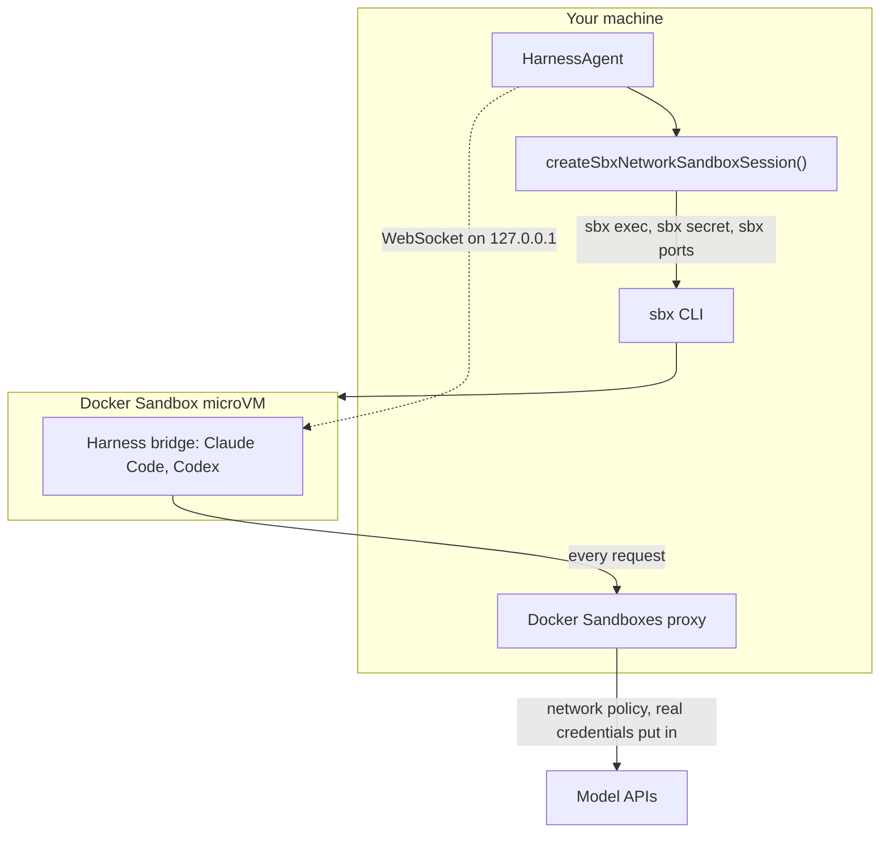
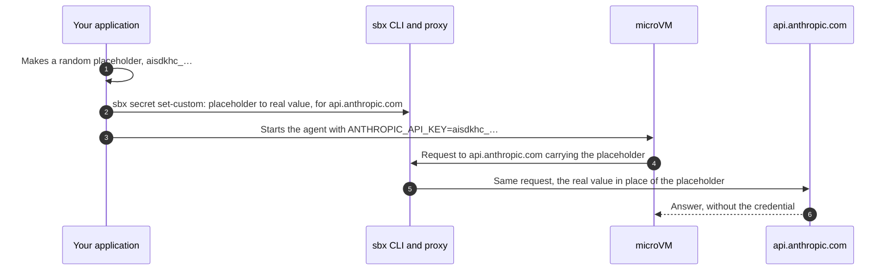

# ai-sdk-sandbox-sbx

<p align="center">
  <a href="https://www.npmjs.com/package/ai-sdk-sandbox-sbx"></a>
  <a href="https://github.com/fpasquet/ai-sdk-harness/actions/workflows/ci.yml"></a>
  
  
  <a href="https://github.com/fpasquet/ai-sdk-harness/blob/main/LICENSE"></a>
</p>

Run [AI SDK harness agents](https://ai-sdk.dev/docs/ai-sdk-harnesses/harness-agent) (Claude Code, Codex, OpenCode…) in a [Docker Sandbox](https://docs.docker.com/ai/sandboxes/): a microVM on your machine, or in Docker Sandboxes Cloud, driven through the `sbx` CLI.

The package gives `HarnessAgent.createSession({ sandboxSession })` what it expects, a `HarnessV1NetworkSandboxSession`, the same way [`@ai-sdk/sandbox-vercel`](https://www.npmjs.com/package/@ai-sdk/sandbox-vercel) does for Vercel Sandbox:

- **Isolation**: every command and file operation is an `sbx exec` into the microVM. Nothing runs on the host, and nothing of the host is mounted unless you ask for it.
- **Credentials stay on the host**: the harness hands the sandbox a placeholder; the Docker Sandboxes proxy swaps the real value in on the way out.
- **The harness is installed once**: pass `agent.getSandboxTemplate()` and the first sandbox is saved as a template image; every later one starts from it in seconds.
- **Local or cloud**: the same API runs the sandbox on your machine, its ports on the loopback only, or in [Docker Sandboxes Cloud](#docker-sandboxes-cloud) with `cloud: true`.


> This package is in its **0.x** series: try it, and tell what works and what does not in the [issues](https://github.com/fpasquet/ai-sdk-harness/issues). Until 1.0.0, a minor release may break its API, and its changelog says how; a patch release never does. The AI SDK harnesses it plugs into are themselves experimental, and its [cloud mode](#docker-sandboxes-cloud) is too. It is a community package, not affiliated with Vercel or Docker.

## How it works



Every command and file operation is an `sbx exec` into the microVM, and every request the sandbox makes leaves through the Docker Sandboxes proxy, which applies the network policy and puts the credentials in.

## Requirements

- Node.js 24 or later.
- [Docker Sandboxes](https://docs.docker.com/ai/sandboxes/get-started/) installed, with `sbx` on the `PATH` (or pointed at by the `binary` option), and signed in (`sbx login`).
- `@ai-sdk/harness` and a harness adapter, such as `@ai-sdk/harness-claude-code`.

## Installation

```bash
pnpm add ai-sdk-sandbox-sbx @ai-sdk/harness @ai-sdk/harness-claude-code
```

## Usage

```ts title="agent.ts"
import { HarnessAgent } from '@ai-sdk/harness/agent';
import { createClaudeCode } from '@ai-sdk/harness-claude-code';
import { createSbxNetworkSandboxSession } from 'ai-sdk-sandbox-sbx';

// Authenticated from CLAUDE_CODE_OAUTH_TOKEN or ANTHROPIC_API_KEY.
const agent = new HarnessAgent({ id: 'coder', harness: createClaudeCode() });

const sandboxSession = await createSbxNetworkSandboxSession({
  // The Claude Code bridge listens on the first port; the harness reaches it on the loopback.
  ports: [4000],
  // The bridge installs its dependencies with pnpm, which the `shell` kit does not ship.
  setup: ['npm install --global --silent pnpm@10'],
  // Bakes Claude Code into a local image the first time, reused afterwards.
  template: await agent.getSandboxTemplate(),
});
const session = await agent.createSession({ sandboxSession });

try {
  const result = await agent.generate({
    session,
    prompt: 'Write a script that prints the first ten primes, then run it.',
  });
  console.log(result.text);
} finally {
  await session.destroy();
  await sandboxSession.destroy();
}
```

The caller owns the sandbox: ending the harness session leaves it running. `stop()` stops its microVM and keeps its files; `destroy()` removes it.

`agent.stream()` works the same way, and its result's `toUIMessageStreamResponse()` feeds `useChat` straight away. The [Next.js example](https://github.com/fpasquet/ai-sdk-harness/tree/main/examples/next-chat) is a complete chat on top of it.

## Templates

A harness bootstraps itself in the sandbox before its first turn: Claude Code installs `@anthropic-ai/claude-agent-sdk` and the `claude` CLI, which takes a minute or two. Pass the agent's template and it happens once:

```ts
const sandboxSession = await createSbxNetworkSandboxSession({
  ports: [4000],
  setup: ['npm install --global --silent pnpm@10'],
  template: await agent.getSandboxTemplate(),
});
```

The first call creates a throwaway sandbox, runs `setup` in it, lets the harness prepare it, saves it with `sbx template save` and removes it. The image is named `ai-sdk-harness-template:<digest>`, the digest covering the harness recipe, the agent kit, the `image` and the `setup` commands, so a new harness version gets an image of its own. Every later sandbox starts from it with `sbx create --template … --pull never`.

The images stay in the sandbox runtime's store: list them with `sbx template ls`, remove an outdated one with `sbx template rm`.

## Resuming a sandbox

Creation never resumes: a sandbox already named `sandboxId` is a conflict. Name the sandbox, keep its id, and reattach to it, from the same process or another one:

```ts
import {
  createSbxNetworkSandboxSession,
  resumeSbxNetworkSandboxSession,
  SbxSandboxNotFoundError,
} from 'ai-sdk-sandbox-sbx';

async function openSandbox() {
  try {
    const sandbox = await resumeSbxNetworkSandboxSession({ sandboxId: 'my-agent', ports: [4000] });
    // A previous run may have left a bridge behind, holding the port.
    await sandbox.killAllProcesses();
    return sandbox;
  } catch (error) {
    if (!(error instanceof SbxSandboxNotFoundError)) throw error;
    return createSbxNetworkSandboxSession({ sandboxId: 'my-agent', ports: [4000] });
  }
}
```

A stopped sandbox starts again on the first command. `sbx` does not remember which ports a harness uses until they are published, so pass the same `ports` again.

## Working on your files

By default the sandbox mounts nothing of the host: the agent works on the microVM's own filesystem. Mount a directory to let it work on yours:

```ts
// Read-write: the agent edits the directory itself.
await createSbxNetworkSandboxSession({ workspace: '/path/to/project', ports: [4000] });

// A private clone of a Git repository instead: the host repository is mounted read-only, and
// the agent's commits come back through the `sandbox-<name>` git remote on the host.
await createSbxNetworkSandboxSession({ workspace: '/path/to/repo', clone: true, ports: [4000] });

// More directories, read-only.
await createSbxNetworkSandboxSession({ readOnlyWorkspaces: ['/path/to/docs'], ports: [4000] });
```

The sandbox's working directory (`defaultWorkingDirectory`, under which the harness creates each session's own directory) is read from the live sandbox: the workspace when one is mounted, `/home/agent/workspace` otherwise.

## Docker and docker compose

Every Docker Sandbox runs a Docker daemon of its own, inside its microVM: the agent can `docker run` and `docker compose up` like on a developer's machine, so it can test a project for real against the services it needs. Clone the project in, then let the agent, or your setup, start its services and run its tests:

```ts
const sandboxSession = await createSbxNetworkSandboxSession({
  workspace: '/path/to/repo',
  clone: true,
  ports: [4000],
});

await sandboxSession.run({ command: 'npm ci && docker compose up -d --wait && npm test' });
```

The images are pulled through the Docker Sandboxes proxy, so the network policy must allow the registries they come from (Docker Hub by default).

Docker is not available in [Cloud Run sandboxes](https://www.npmjs.com/package/ai-sdk-sandbox-cloud-run): use this package for projects that need containers.

## Docker Sandboxes Cloud

With `cloud: true`, the sandbox runs in Docker Sandboxes Cloud rather than on your machine: every `sbx` command goes out as `sbx --cloud …`. It needs a [Docker Agentic Platform](https://agentic-platform.docker.com) subscription and `sbx login` (personal access tokens carry no cloud access).

```ts
const sandboxSession = await createSbxNetworkSandboxSession({
  cloud: true,
  ports: [4000],
  setup: ['npm install --global --silent pnpm@10'],
  template: await agent.getSandboxTemplate(),
  ttl: '2h',
  onTimeout: 'stop',
});
```

What changes from a local sandbox:

- **Nothing of your machine is mounted**: `workspace`, `clone` and `readOnlyWorkspaces` are refused. Copy what the agent needs in with `writeFile()`, or clone it from inside the sandbox.
- **Ports get a public URL** assigned by the control plane, instead of a loopback port. The harness bridges authenticate their connections with a token of their own.
- **Credentials are set by the proxy**: the cloud proxy puts the whole header on the requests to the host, under a secret named after the sandbox, the host and the header. Cloud secrets belong to the account, so `destroy()` removes them too.
- **Templates live in the cloud registry**, named `ai-sdk-harness-template-<digest>`. Saving one snapshots the running sandbox and takes several minutes; list them with `sbx --cloud template ls`.
- **A cloud sandbox has a time-to-live**, 24 hours at most: set it with `ttl` and `onTimeout`, extend it with `extendTtl('1h')`. `stop()` suspends it with its memory.
- **Sizing** comes in billable shapes: `cpus` and `memory` together, 2 / `4g` by default. `allowNetwork` and `platform` are cloud-only settings.

**Cloud support is experimental**: it follows the `sbx --cloud` command reference, and may change in a minor release while it settles. Its e2e suite runs with `SBX_E2E_CLOUD=1 pnpm test:e2e`.

## Credentials

A harness that supports credential brokering never puts the real credential in the sandbox. It hands the sandbox a random placeholder, an `aisdkhc_…` string, and asks the sandbox session to transform the requests on their way out. This package turns each transformation into an `sbx secret set-custom` scoped to the sandbox: the Docker Sandboxes proxy then puts the real value in the requests to the API's host. The agent can use the credential to call its API; it cannot read it.



| Harness and sign-in                                                             | What the sandbox sees               | What the proxy is given                                     |
| ------------------------------------------------------------------------------- | ----------------------------------- | ----------------------------------------------------------- |
| Claude Code, API key (`ANTHROPIC_API_KEY`)                                      | `ANTHROPIC_API_KEY=aisdkhc_…`       | The key, for `api.anthropic.com`                            |
| Claude Code, Claude subscription (`CLAUDE_CODE_OAUTH_TOKEN`, or `claude` login) | `CLAUDE_CODE_OAUTH_TOKEN=aisdkhc_…` | The access token alone: the refresh token stays on the host |
| Codex, API key (`OPENAI_API_KEY`)                                               | `CODEX_API_KEY=aisdkhc_…`           | The key, for `api.openai.com`                               |
| Codex, ChatGPT subscription (`codex` login)                                     | `CODEX_API_KEY=aisdkhc_…`           | The access token, for `chatgpt.com`                         |

A local proxy swaps the placeholder for the value; a cloud proxy sets the whole header. Where the real value lives:

- **On the host**, where your application reads it, and **in the Docker Sandboxes proxy**, which keeps the custom secrets of the sandbox.
- **On the host's `sbx` command line**, for the time `sbx secret set-custom` runs: another user of the host could see it in the process list. Run the application on a host of its own.
- **Never in the sandbox**, its files or its template.

The placeholders are withdrawn by `release()` and `stop()`, and removed with the sandbox by `destroy()`; a cloud secret belongs to the account until `destroy()` removes it.

Brokering can be turned off with `brokerCredentials: false`, for an `sbx` without custom secrets: the harness then forwards the **real credential** into the sandbox environment, where the agent can read it. Keep it on.

Docker Sandboxes also pre-sets its own credential variables (`ANTHROPIC_API_KEY`, `OPENAI_API_KEY`, `GH_TOKEN`…) to a `proxy-managed` placeholder, for credentials stored with `sbx secret set`. Left in place, one can take precedence over the credential the harness passes (the `claude` CLI prefers `ANTHROPIC_API_KEY` to `CLAUDE_CODE_OAUTH_TOKEN`), so they are dropped from every command that does not set them itself. Keep them with `keepProxyManagedEnv: true`; drop more with `clearEnv`.

Variables a command does set are forwarded as bare `sbx exec -e NAME`: `sbx` reads the value from its own environment, so it never appears on a command line.

## Network

Outbound traffic goes through the Docker Sandboxes proxy and its policy (`sbx policy`). `denyNetwork` adds deny rules for the new sandbox only. A local deny can only narrow egress, so it holds whatever the global policy allows:

```ts
await createSbxNetworkSandboxSession({
  denyNetwork: ['github.com', '*.github.com'],
  ports: [4000],
});
```

`setNetworkPolicy` is not implemented: the harness treats it as optional, and `sbx policy` remains the place to manage what the sandbox may reach.

## Ports

`ports` lists the ports inside the sandbox the harness may reach. Each one is published the first time `getPortEndpoint()` asks for it, on this host's loopback (`127.0.0.1:<free port>`) or, for a cloud sandbox, at the public `https://` URL the control plane assigns, and unpublished by `release()`, `stop()` or `setPorts()`. A port outside the list is refused with `HarnessCapabilityUnsupportedError`.

## Lifecycle

| Method                | What it does                                                                                      |
| --------------------- | ------------------------------------------------------------------------------------------------- |
| `release()`           | Stops the processes this session started, unpublishes its ports, withdraws its placeholders       |
| `killAllProcesses()`  | Stops every process any session started in the sandbox, including what a previous run left behind |
| `stop()`              | `release()`, then stops the microVM. Its files stay; the next command starts it again             |
| `extendTtl(duration)` | Extends the time-to-live of a cloud sandbox (`'1h'`), within its 24 hours                         |
| `destroy()`           | Removes the sandbox, its files and its secrets                                                    |
| `restricted()`        | The files-and-processes view of the same sandbox, to hand to tools (see below)                    |

`restricted()` returns an `Experimental_SandboxSession`: it can run commands and read and write files, but cannot stop the sandbox, publish ports or touch credentials. Pass it to AI SDK tools that accept `experimental_sandbox`.

## Options

`createSbxNetworkSandboxSession(options)` takes every option below; `resumeSbxNetworkSandboxSession(options)` takes `sandboxId`, `abortSignal`, `cloud` and the connection settings.

| Option                | Default        | Description                                                                                     |
| --------------------- | -------------- | ----------------------------------------------------------------------------------------------- |
| `sandboxId`           | `ai-sdk-<hex>` | The sandbox's name in `sbx ls`. Creation fails if it is taken                                   |
| `template`            | none           | `await agent.getSandboxTemplate()`: prepare once, start every later sandbox from the image      |
| `abortSignal`         | none           | Aborts the creation or the resume                                                               |
| `agent`               | `'shell'`      | The Docker Sandboxes agent kit: its image and network rules                                     |
| `image`               | the kit's own  | Container image to use instead (`sbx create --template`)                                        |
| `cloud`               | `false`        | Run in Docker Sandboxes Cloud (`sbx --cloud`) rather than on this host                          |
| `workspace`           | none           | Host directory to mount read-write as the working directory (local only)                        |
| `clone`               | `false`        | With `workspace`: a private clone of the Git repository instead (local only)                    |
| `readOnlyWorkspaces`  | `[]`           | More host directories, mounted read-only (local only)                                           |
| `denyNetwork`         | `[]`           | Hosts the sandbox may never reach (`sbx create --deny-network`)                                 |
| `allowNetwork`        | `[]`           | Hosts a cloud sandbox may reach, on top of the account's policy (cloud only)                    |
| `cpus`                | decided by sbx | CPUs of the microVM                                                                             |
| `memory`              | decided by sbx | Memory limit of the microVM (`4g`, `512m`)                                                      |
| `platform`            | decided by sbx | `linux/amd64` or `linux/arm64` (cloud only)                                                     |
| `ttl`                 | decided by sbx | Time-to-live of a cloud sandbox, 24 hours at most (cloud only)                                  |
| `onTimeout`           | decided by sbx | `stop`, `restart` or `delete` the cloud sandbox when its `ttl` lapses (cloud only)              |
| `setup`               | `[]`           | Commands run once after creation, as the sandbox user (who has `sudo`), baked into the template |
| `ports`               | `[]`           | _Connection._ Ports the harness may reach, published on demand                                  |
| `brokerCredentials`   | `true`         | _Connection._ Keep credentials out of the sandbox, swapped in by the proxy                      |
| `clearEnv`            | `[]`           | _Connection._ More variables to drop from commands that do not set them                         |
| `keepProxyManagedEnv` | `false`        | _Connection._ Keep the `proxy-managed` credential variables Docker Sandboxes pre-sets           |
| `binary`              | `'sbx'`        | _Connection._ The `sbx` binary                                                                  |

## Errors

- `SbxSandboxNotFoundError`: `resumeSbxNetworkSandboxSession()` found no sandbox of that name. Carries `sandboxId`.
- `SbxError`: an `sbx` command exited with a non-zero status. Carries `args`, `exitCode` and `stderr`.
- `HarnessCapabilityUnsupportedError` (from `@ai-sdk/harness`): a port that is not exposed, or a credential the proxy cannot broker.

## Limitations

- **One bridge per port.** A bridge-backed harness listens on the first port: run one harness session at a time per sandbox, or give each its own port.

## Development

This package lives in the [`ai-sdk-harness`](https://github.com/fpasquet/ai-sdk-harness) monorepo. `pnpm test` runs the unit tests against a fake `sbx`; `pnpm test:e2e` runs them against the real one, creating and removing sandboxes on your machine.

## License

[MIT](https://github.com/fpasquet/ai-sdk-harness/blob/main/LICENSE)
